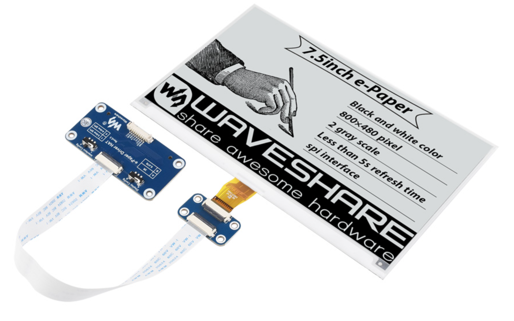

# Glossar

## Displaymodul

Komplettes Set bestehend aus Display, Mikrocontroller, Akku, Platine und Gehäuse. 

## Display

Das Display, welches angesteuert und mit Strom und Daten versorgt werden muss. 
Figure: Ein exemplarisches ePaper Display { #_fig_MW_ePaper } 

 { width=30% }

## Mikrocontroller

Im Displaymodul verbauter Computer, welcher Drahtlos mit Clients kommunizieren kann und die Ansteuerung des Displays übernimmt. 

## Mikrocontroller Webserver

Kann immer Bitmaps über HTTP empfangen und im (Standalonemodus) zusätzlich die Client Website an einen Client ausliefern. 

## Client

Gerät (Smartphone, Tablet, Computer) worüber der Benutzer, mittels einem Browser, mit dem Displaymodul direkt (Standalonemodus) oder alternativ mit dem Zentralen Webserver (Servermodus) kommuniziert. 

## Client Website

Die im Client sichtbare Website bestehend aus HTML, CSS und JavaScript. 

## Server

Linux Container, welcher den Zentralen Webserver betreibt. 

## Server Webserver

Läuft auf dem Server 24/7. Kann sich Daten von externern Quellen holen, diese von HTML in Bitmaps konvertieren und die Bitmaps an Displaymodule verteilen. 

## Server Website

Website für den Client, welche auf dem Zentralen Webserver läuft und womit sich mehrere Displaymodule steuern lassen. 

## Standalonemodus

Der Client kommuniziert direkt mit dem Mikrocontroller, dabei erstellt der Mikrocontroller selber ein WLAN. Der Mikrocontroller arbeitet also als WLAN AccessPoint. 

## Netzwerkmodus

Der Client kommuniziert direkt mit dem Mikrocontroller, dabei wird ein vorhandenes WLAN benutzt. Der Mikrocontroller arbeitet also als WLAN Client. 

## Servermodus

Der Client kommuniziert nur über den Server Webserver mit dem Mikrocontroller, dabei wird ein vorhandenes WLAN benutzt. Der Mikrocontroller arbeitet also als WLAN Client.
