# Hardware

## Auswahl des Mikrocontrollers
**Benjamin Klaric**

In der Tabelle in Kapitel [3.1 Mikrocontroller](PraktischeUTheoretischeGrund.md#mikrocontroller) wurden schon die verschiedenen Möglichkeiten zur Auswahl von Mikrocontrollern dargestellt. Wenn man die Anforderungen, wie Anzahl GPIO Pins, Stromverbrauch in Sleep Modi, Bauform, interne Speicher und mögliche Vorteile über den anderen, wie z. B. intern gebauten Ladegerät, erschien schon ein eindeutiger Gewinner, in Form von XIAO ESP32-S3.  
Die verschiedenen STM32 Mikrocontroller waren auch lange Zeit in Betrachtung, wurden aber herausgelassen aufgrund der Tatsache, dass sie kein eingebautes Wi-Fi-Modul haben.  
Der XIAO ESP32-S3 mit seinem kleinen Formfaktor, sehr geringen Stromverbrauch in Deep Sleep Modus, enormen Internen speicher (im Vergleich mit anderen Kandidaten) und Möglichkeit, die Akku über den USB-C-Anschluss zu laden, machen den Mikrocontroller sehr flexibel und für das Systemanforderungen passend. [[BK_07]](Quellenverzeichnis.md#BK_07)  
Der Prozessor, der auf dem Mikrocontroller läuft, ist der leistungsstarke Xtensa LX7 Dual-Core, 32-Bit-Prozessor, mit bis zu 240 MHz Taktfrequenz. Mit internen 512 KB SRAM-Speichern ist er in der Lage, viele Operationen und Funktionen lokal durchzuführen. Neben dem SRAM-Speicher ist der Mikrocontroller auch extern mit 8 MB Flash und 8 MB PSRAM Speicher ausgestattet. Der Mikrocontroller ist auch mit interner Hardware Watchdog Timers ausgestattet, die in dem Fall, wo der Mikrocontroller hängend geblieben ist, eine Möglichkeit von Neustart des Systems anbietet. [[BK_08]](Quellenverzeichnis.md#BK_08)  
Aufgrund der niedrigen Idle Strom von 22 mA und noch niedrigere Deep Sleep Strom von 14 μA stellt sich das Modul perfekt für ein autarkes System. Die Möglichkeit von Laden der Akkus durch das USB-C ist natürlich auch von Vorteil, allerdings mit einem niedrigen Ladestrom von 100 mA. Und das alles befindet sich auf einer kleinen Platine mit Maßen 21x17,5 mm, der ungefähre Große von einer 2-Euro-Münze. [[BK_07]](Quellenverzeichnis.md#BK_07)  
Der XIAO ESP32-S3 stellt elf GPIO Pins zur Verfügung, was auf [Abildung 7.xx](#_fig_BK_03) zu sehen ist. Von diesen elf GPIO-Pins sind neun analoge Pins, an die man analoge Signale anschließen kann. Neben den UART-Pins, die für die serielle Kommunikation mit dem Mikrocontroller genutzt werden, bietet der XIAO ESP32-S3 auch eine SPI- und eine I2C-Schnittstelle. Diese Schnittstellen sind serielle synchrone Datenbusse, die zur Kommunikation mit verschiedenen Peripheriegeräten verwendet werden. Der 5V-Pin ist nur dann aktiv, wenn das Modul über den USB-C-Anschluss betrieben wird. Andererseits ist der 3,3V-Pin ist immer aktiv und dient als regulierter Ausgang mit einem maximalen Strom von 700 mA. [[BK_07]](Quellenverzeichnis.md#BK_07)  

Figure: Pinout von XIAO ESP32-S3 [[BK_07]](Quellenverzeichnis.md#BK_07) { #_fig_BK_03 }

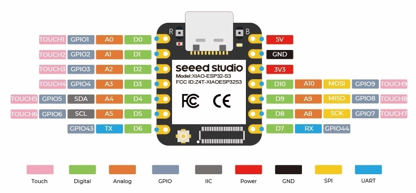{ width=85% }

## Auswahl der Displaytechnologie

## Auswahl der Akkukomponenten
**Benjamin Klaric**

**Akku**  
Der ausgewählte Akku, aus verschiedenen Akku-Technologien, die in [3.3.1 Vergleich und Auswahl von verschiedenen Akku-Technologien](PraktischeUTheoretischeGrund.md#vergleich-und-auswahl-von-verschiedenen-akku-technologien) genannt waren, war der klassische Li-Ion-Akku, aus mehreren Gründen. Aufgrund der Anzahl und Position des Systems, die von Akku betrieben sein wurde, war der Sicherheitsaspekt ein entscheidender Faktor. Deswegen wurden die LiPo-Akkus nicht mehr betrachtet.  
Der Vergleich zwischen Li-Ion-Akkus und LiFePo~4~-Akkus hatte eindeutige Unterschiede geliefert. Die LiFePo~4~-Akkus repräsentieren die sicherste Variante, andererseits hatten die Li-Ion-Akkus eine höhere Nennspannung von 3,7V.  
Aus Sicherheitsblick betrachtet wurden die LiFePo~4~-Akkus ausgewählt. Die Nennspannung von 3,2V hat jedoch gegen die LiFePo~4~-Akkus gesprochen, da der ausgewählte Mikrocontroller, nämlich den XIAO ESP32-S3, Betriebsspannung zwischen 3,2V und 4,2V angefordert hat. Obwohl die LiFePo~4~-Akkus die Betriebsspannung liefern konnten, konnten sie das System nicht betreiben, da die genannte Betriebsspannung in Fall ohne schwere Last gemeint ist. Wegen dies wurden allerdings die Li-Ion-Akkus gewählt.  
Der nächste Schritt war, eine vernünftige Kapazität zu finden, sodass die Akkus das System lang genug betreiben konnten. Dazu hat man die Schätzungen mit Verbrauchmessungen unterstützt und ungefähr die benötigte Akku-Kapazität geschätzt. Eine Akkulaufzeit von einem Jahr war gewünscht und dementsprechend war die Große des Akkus gewählt, nämlich ~10000 mAh.  
Ein Akku mit so einer Kapazität war aber nicht einfach zu finden. Deswegen wurde das Akkupack aus zwei ~5000 mAh Akkus gebaut. Um von zwei ~5000 mAh auf die gewünschte Kapazität zu kommen, wurden die Akkus in parallel verbunden, da so die Kapazität sich verdoppelt; im Vergleich, wenn man die in Reihe anschließt, so wird die Spannung verdoppelt.  
Bei der Suche nach Akkus muss man einige Sachen beachten. Der Formfaktor der Akku, minimale Kapazität, ob der Akku schon ein eingebautes BMS hat und der Entladestrom.  
Es würde die BAK N21700CD-53E ausgewählt, die auf [Abildung 7.xx](#_fig_BK_04) zu sehen ist.

Figure: Li-Ion-Akku [[BK_09]](Quellenverzeichnis.md#BK_09) { #_fig_BK_04 }

{ width=60% }

Aus der Tabelle der technischen Daten auf der [Abildung 7.xx](#_fig_BK_05) des betrachteten Akkus ist es klar zu sehen, dass alle benötigten Parameter erfüllt sind. Der Formfaktor ist aus der Durchmesser und Höhe (die ersten zwei Ziffern von Durchmesser und normalerweise erste drei Ziffern von Höhe → 21700).  

Figure: Technische Daten von BAK N21700CD-53E [[BK_09]](Quellenverzeichnis.md#BK_09) { #_fig_BK_05 }

{ width=65% }

**BMS**  
Um den Akkupack sicher betreiben zu können, wurde ein BMS benötigt. Wie bereits in [3.3 Akku-Technologien](PraktischeUTheoretischeGrund.md#akku-technologien) unter Akku-Technologien erwähnt, schützt ein BMS die Akkus vor Tiefentladung, Überladung, Kurzschluss und Überstrom.  

Beim genaueren Blick auf ein 1S 2MOS BMS, auf [Abildung 7.xx](#_fig_BK_06), wo 1S die Anzahl der Zellen in Serie repräsentiert, erkennt man ein IC und zwei MOSFET Transistoren auf die Vorderseite. Die MOSFET Transistoren sind nämlich die NMOS-Transistoren und dienen als Schalter, die vom IC durch Gate-Spannung angesteuert werden.  

**Überladungsschutz**: Wenn die Ladespannung 4,2V überschreitet, sendet der IC ein Signal, das die Gate-Spannung eines NMOS-Transistors steuert, wodurch dieser den Stromkreis unterbricht.  

**Tiefentladungsschutz**: Bei Tiefentladung wird ein ähnlicher Mechanismus aktiviert, allerdings bei 2,5V. Der IC sendet ein Signal an den zweiten NMOS-Transistor, um den Stromfluss zu unterbrechen, sobald die Spannung einen kritischen Wert erreicht.  

**Überstromschutz**: Der IC überwacht den Stromfluss kontinuierlich. Wenn der Strom über den zulässigen Grenzwert steigt, schaltet der IC einen der NMOS-Transistoren ab, um den Stromfluss zu unterbrechen und die Batterie vor Schäden zu schützen.  

**Kurzschlussschutz**: Auch bei einem Kurzschluss, bei dem sehr hohe Ströme fließen, erkennt der IC diese Situation und unterbricht sofort den Stromfluss durch Abschalten der NMOS-Transistoren.  

Das BMS, das auf [Abildung 7.xx](#_fig_BK_06) dargestellt ist, liefert alle diese Features und wurde für den Aufbau von dem Akkupack ausgewählt.  

Figure: 1S 2MOS Batteriemanagementsystem [[BK_10]](Quellenverzeichnis.md#BK_10) { #_fig_BK_06 }

{ width=60% }

**Ladegerät**  
Wie bereits in [3.3 Akku-Technologien](PraktischeUTheoretischeGrund.md#akku-technologien), benötigen die Li-Ion-Akkus ein spezielles Ladegerät, nämlich ein Ladegerät, der in die Lage ist beim Laden der Akkus, erste 80% konstanter Strom zu liefern und danach 20% die Akkus mit konstanter Spannung zu laden.  
Man kann solche Ladegeräten ohen viele Schwierigkeiten finden, sind allerdings teuer. Bei der Suche nach einen muss man eine Sache beachten, nämlich den Zellenanzahl. Die ausgewählte Ladegerät ist auf die [Abildung 7.xx](#_fig_BK_07) zu sehen.  

Figure: Ladegerät für Li-Ion-Akkus [[BK_11]](Quellenverzeichnis.md#BK_11) { #_fig_BK_07 }

{ width=60% }

## Zusammenbau der Akkupacks
**Mario Wegmann**

### Konzeptioneller Aufbau

Bei der Auswahl der Akkukomponenten wurde die Entscheidung getroffen, mehrere Lithium-Ionen-Zellen zu verwenden. Da die Kapazität des Akkupacks vergrößert wird, die Batteriespannung jedoch weiterhin zwischen 2,5 V und 4,2 V liegen soll, werden die beiden Lithium-Ionen-Zellen parallel miteinander verbunden. Dadurch verdoppelt sich die Kapazität, während die Spannung gleich bleibt. Zudem wird der gemeinsame Pluspol mit dem Plus des Battery Management System verbunden und ebenso mit dem Minuspolen verfahren. Zum Verbinden von den Akkuzellen untereinander und mit dem BMS eignet sich ein Nickelband, welches auch als Hiluminband bekannt ist[[MW_07]](Quellenverzeichnis.md#MW_07). Der Aufbau des Akkus ist auch in den Abbildungen  und  ersichtlich. 

Figure: Konzeptioneller Aufbau des Akkus { #_fig_MW_Akkukonzept }

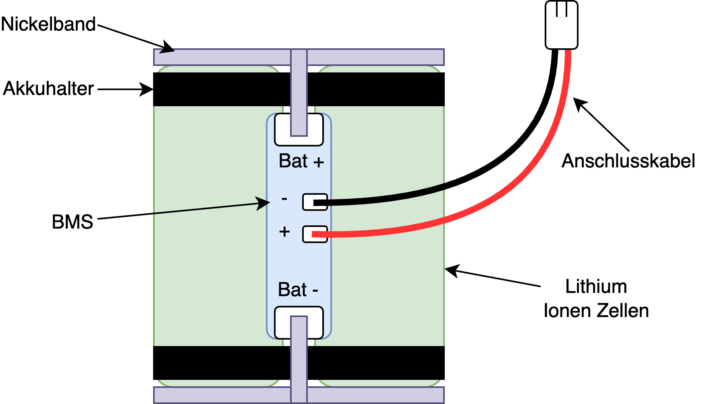{ width=60% }

Figure: Foto des aufgebauten Akkus { #_fig_MW_Akkubild }

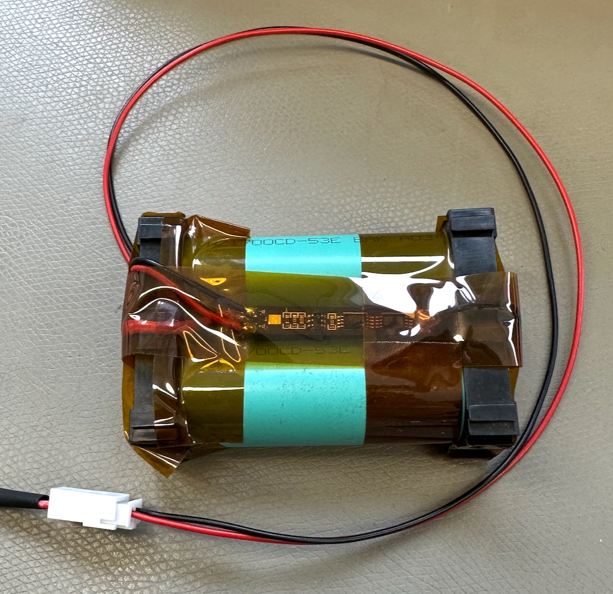{ width=60% }

### Battery Management System anschließen
Als Erstes sollte das BMS verdrahtet werden. In diesem Projekt wurde sich dafür entschieden, dass das Akkupack über einen Stecker mit dem Mainboard verbunden werden kann und somit modular ist. Somit wurde an den Ausgängen des BMS ein 2 Pin JST-X2 Stecker gelötet. Hierbei wurde sich im Team intern darauf geeinigt, dass der Pluspol rechts ist, wenn von der Drahtseite auf den Stecker geschaut wird und die Nase des Steckers nach oben zeigt. An den Pads für die Batteriepole wurde das Nickelband ebenso verlötet. 

### Vorbereiten der Lithium-Ionen-Zellen
Für einen sicheren Umgang mit Lithium-Ionen-Zellen ist es wichtig, mehrere Dinge zu beachten, bevor mehrere Zellen miteinander verbunden werden können. 
Bereits beim Beschaffen von den Zellen sollte darauf geachtet werden, das identische Modell und eine gleiche Charge zu verwenden. 
Zudem sollten Zellen, die verbunden werden sollen, möglichst gleich alt und auch gleich belastet werden oder im Optimalfall komplett neu sein. 
Zuletzt sollte vor dem Verbinden darauf geachtet werden, dass die Zellen die gleiche Zellspannung aufweisen, um einem schlagartigen Ladungswechsel beim Verbinden vorzubeugen.

Nachdem die einzelnen Zellen vorbereitet waren, wurden diese in die Plastikhalter eingelegt. Diese Plastikabstandshalter ergeben zusammen mit den Zellen ein stabiles Gesamtsystem und halten die Zellen davor ab, sich direkt zu berühren.  

### Punktschweißverfahren bei Lithium-Ionen-Zellen
Lithium-Ionen-Zellen sind wärmeempfindlich und daher ist Weichlöten kein geeignetes Verfahren, um die Zellen mit dem Hiluminband zu verbinden, stattdessen eignet sich das Punktschweißverfahren. Hierbei wird das Nickelband an einem Pol einer Zelle gepresst und dann die zwei Elektroden des Punktschweißgerätes auf das Nickelband gedrückt. Bei dem in diesem Projekt verwendeten Gerät fließen durch die beiden Elektroden 650 Ampere bei 4,2 Volt, dieser hohe Strom führt zu einem Schweißpunkt, welcher das Nickelband und den Pol fest verbindet, jedoch aufgrund der kurzen Dauer des Prozesses von circa 5 Millisekunden kaum eine Wärmebelastung für die Akkuzelle darstellt. Das Nickelband, welches bereits mit dem BMS verbunden ist, wurde um ein weiteres Nickelband orthogonal dazu erweitert. Dadurch ergibt sich eine Nickelverbindung in T-Form. An beiden offenen Enden wurde jeweils ein Batteriepol angeschlossen. Dies wurde für die andere Polseite wiederholt [[MW_08]](Quellenverzeichnis.md#MW_08).

### Isolieren des Akkupacks
Abschließend wurde Kapton Klebeband verwendet, um das Akkupack mit einer isolierenden Schicht zu umhüllen. Dadurch wird vermieden, dass unkontrolliert die Batteriepole mit anderen leitfähigen Materialien in Berührung kommen und sämtlicher Strom über das BMS geleitet wird. Kapton Klebeband ist dabei ein sehr guter elektrischer und thermischer Isolator. 

## Schaltungsentwurf
**Benjamin Klaric**  

Um das gesamte System optimal zu gestalten, wurde eine Platine entworfen, die alle benötigten Komponenten und Schaltungen integriert, um die normale Funktionalität des Systems zu gewährleisten. Für die Entwicklung der Platine war ein präziser Schaltungsentwurf mit den richtigen Komponenten erforderlich. Der Schaltungsentwurf sowie der Platinentwurf wurden mithilfe der ECAD-Software KiCad erstellt. Die Auswahl der geeigneten Komponenten sowie eine detaillierte Beschreibung der Schaltung sind im folgenden Abschnitt beschrieben.  
Alle Komponenten, die in der Schaltung beinhaltet sind, befinden sich in dem sogenannten Bill of Materials (kurz BOM).  

**Ganze Schaltung**  
Auf die [Abildung 7.xx](#_fig_BK_08) ist die vollständige Schaltung mit allen Teilschaltungen dargestellt.  

Figure: Ganze Schaltung für das Mainboard des Systems { #_fig_BK_08 }

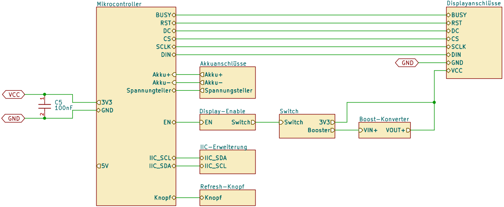{ width=80% }

Wenn man die [Abildung 7.xx](#_fig_BK_08) betrachtet, sind die Verbindungen zwischen den Teilschaltungen und die Gesamtverdrahtung der Schaltung sichtbar. Spätere Abschnitte behandeln jede Teilschaltung einzeln, und es wird empfohlen, zur Gesamtabbildung der Schaltung zurückzukehren, um die Verbindung der erklärten Teilschaltungen im Gesamtkontext zu sehen.  
Ganz links in der Abbildung ist ein 100 nF Kondensator, speziell C5, zwischen 3,3V (V~CC~) und Ground (GND) parallel geschaltet. Dieser dient als Entkopplungskondensator, um Spannungsschwankungen zu reduzieren und die Stabilität der Stromversorgung sicherzustellen. Der 100 nF Kondensator fängt hochfrequente Störungen ab und glättet diese. Dadurch verbessert er die Betriebssicherheit des Systems, insbesondere während schneller Schaltvorgänge, indem er eine stabile Spannungsversorgung gewährleistet und die Signalqualität erhöht. Dieser Wert von 100 nF ist ein Standardwert für Entkopplungskondensatoren bei niedrigen Frequenzen. [[BK_12]](Quellenverzeichnis.md#BK_12) [[BK_13]](Quellenverzeichnis.md#BK_13)  
Ein Kondensator mit der 1210 Bauform wurde aus Platzgründen gewählt, obwohl jeder 100 nF Kondensator diese Aufgabe erfüllen könnte. Die Wahl der Bauform von Kondensator und anderer Bauteile wurde entsprechend den Platzanforderungen getroffen.  

**Mikrocontroller**  
Wenn man die Teilschaltung des Mikrocontrollers auf der [Abildung 7.xx](#_fig_BK_09) betrachtet, fällt auf, dass außer dem Mikrocontroller keine weiteren Komponenten zu sehen sind. Die gesamte Schaltung wurde in Teilschaltungen oder sogenannte Subsheets, wie das Feature in KiCad genannt ist, aufgeteilt, um sie übersichtlicher darzustellen.  

Figure: Ausgänge des Mikrocontrollers { #_fig_BK_09 }

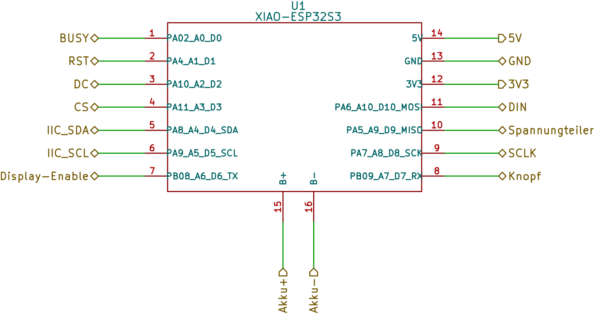{ width=60% }

In dieser Teilschaltung sind die Ausgänge des Mikrocontrollers hierarchischen Labels mit entsprechenden Namen zugeordnet.  

**Akkuanschlüsse**  
Die Akkuanschlüsse in der Teilschaltung beinhalten einen Stecker, konkret den J1, sowie einen Spannungsteiler, der aus R5 und R6 besteht. Diese Komponenten sind auf der [Abildung 7.xx](#_fig_BK_10) dargestellt.  

Figure: Schaltung von Akkuanschlüsse { #_fig_BK_10 }

{ width=50% }

Der Akkupack ist über den Stecker mit den Akkuanschlüssen des Mikrocontrollers verbunden. Parallel dazu ist ein Spannungsteiler aufgebaut. Der Zweck dieses Spannungsteilers besteht darin, die Spannung des Akkupacks zu messen, indem ein analoger GPIO-Pin des XIAO ESP32-S3 verwendet wird. Dadurch wird der Zustand des Akkupacks genau überwacht, um sicherzustellen, dass ausreichend Spannung für den Mikrocontroller bereitgestellt wird.  

**Display-Enable**  
Auf der [Abildung 7.xx](#_fig_BK_11) ist die sogenannte Display-Enable Schaltung zu sehen. Man kann drei Widerstände, nämlich den R1, R2 und R3 erkennen, neben den zwei MOSFETs, einen NMOS und einen PMOS Transistor.

Figure: Schaltung von Display Enable { #_fig_BK_11 }

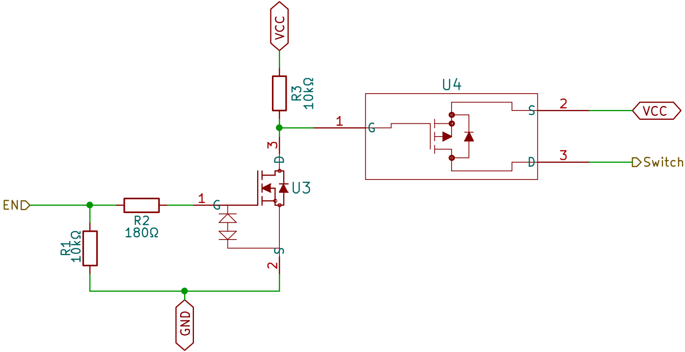{ width=70% }

Der E-Paper Technologie von Displays verbraucht tatsächlich keinen Strom im Idle-Zustand. Das gleiche kann aber nicht für die kleinen Zwischenplatinen gesagt werden, die Parallelport-Kommunikationsverfahren zu SPI übersetzen. Diese verbrauchen ständig Strom, was eine unerwünschte Folge ist. Um den Stromverbrauch zu optimieren, wurde eine Schaltung entworfen, die die Stromversorgung des Displays durch Code trennt.  
Um die Schaltung per Code ansteuern zu können, wurden zwei MOSFETs verwendet: ein N-Channel MOSFET und ein P-Channel MOSFET. Der Ausgang des Mikrocontrollers geht über den 180 Ω Widerstand, nämlich R2, auf das Gate des N-Channel MOSFET (U3). Der 180 Ω Widerstand dient dazu, den Gate-Strom zu begrenzen und das Schalten des Transistors zu stabilisieren. Dazu wird auch ein Pulldown-Widerstand (R1) eingesetzt, da beim Einschalten des Mikrocontrollers der EN-Ausgang nicht sofort auf 0V gesetzt sein könnte. Ein Wert von 10 kΩ ist ein Standardwert, weil er ausreichend ist, um das Gate sicher auf 0V zu ziehen, ohne signifikant Strom zu verbrauchen. Um ein unnötiges Einschalten des NMOS zu vermeiden, wurde der Pulldown-Widerstand gesetzt.  
Die Source-Leitung des NMOS ist mit dem Ground verbunden, da dies dem Funktionsprinzip des NMOS entspricht. Die Drain-Leitung ist mit dem Gate des P-Channel MOSFET (U4) verbunden und auch mit einem Pull-up-Widerstand (R3). Der Pull-up-Widerstand sorgt dafür, dass das Gate des PMOS auf 3,3V gehalten wird, wenn der NMOS nicht leitend ist, wodurch der PMOS ausgeschaltet bleibt.  
Der NMOS-Transistor (U3) schaltet ein, wenn der EN-Pin des Mikrocontrollers auf High (3,3V) geht. Dadurch wird das Gate des PMOS-Transistors auf 0V gezogen. Der PMOS-Transistor (U4) schaltet ein, wenn das Gate auf 0V gezogen wird, wodurch die Verbindung zwischen VCC und Switch geschlossen wird.  
Die ausgewählten MOSFETs wurden aufgrund ihrer niedrigen Schwellenspannung und ihres geringen R_DS(on)-Widerstands gewählt, was eine effiziente und zuverlässige Schaltung ermöglicht.  

**Switch**  
Man kann auf der [Abildung 7.xx](#_fig_BK_12) ein Switch erkennen, der dafür zuständig ist, die Betriebsspannung des Displays auszuwählen, zwischen direkten 3,3V oder dem Ausgang von Booster Schaltung.

Figure: Switch für Ansteuerung der Betriebsspannung { #_fig_BK_12 }

{ width=50% }

Der Switch wird per Bedarf mittels menschlichen Einfluss die Leitung zur Betriebsspannung von Display umleiten, zu Booster Schaltung oder direkt mit dem 3,3V Ausgang von Mikrocontroller verbinden. Diese Funktionalität ist so ausgedacht, sodass man die Platine generisch halten kann, um verschiedene Displays mit verschiedenen Betriebsspannungen anzusteuern.  

**Boost-Converter**  
Die Boost-Converter Schaltung, die auf der [Abildung 7.xx](#_fig_BK_13) dargestellt ist, hat die Aufgabe, die Betriebsspannung zu erhöhen.  

Figure: Booster Schaltung { #_fig_BK_13 }

{ width=70% }

Der Boost-Converter befindet sich in der Mitte der Schaltung. Die L1 speichert Energie in ihrem Magnetfeld, wenn Strom durch sie fließt. Während der Schaltzyklen des Boost-Converters wird diese Energie verwendet, um die Spannung am Ausgang zu erhöhen. Wenn der Schalter innerhalb des Moduls geschlossen ist, fließt Strom durch die Induktivität und speichert Energie. Wenn der Schalter öffnet, wird die gespeicherte Energie freigesetzt, wodurch die Spannung über der Induktivität ansteigt und die Ausgangsspannung erhöht wird. Das Ausgangskondensator, nämlich den C3, glättet die Ausgangsspannung und reduziert das Rauschen am Ausgang des Boost-Converters. Die L1 zusammen mit C3 nennt sich ein LC-Glied und dient als ein Tiefpassfilter, das hochfrequente Störungen und Rauschen herausfiltert und eine gleichmäßige Gleichspannung liefert. Der Eingangskondensator C1 reduziert Spannungsrauschen und glättet die Eingangsspannung, bevor sie in die Schaltung eintritt. Die sogennante Bypass Kondensator C2 dient dazu, hochfrequente Störungen und Rauschen herauszufiltern. Der C4 Kondensator wird verwendet, um elektromagnetische Interferenzen (EMI) zu reduzieren. Er hilft dabei, Rauschen und Störungen zu filtern, die durch die Schaltung erzeugt werden könnten und sorgt für eine saubere Ausgangsspannung.  
Der Boost-Converter hat intern auch eine galvanische Trennung. Diese galvanische Trennung dient dazu, elektrische Isolation zwischen dem Eingang und dem Ausgang zu gewährleisten. Sie schützt vor elektrischen Störungen und sorgt dafür, dass keine direkten elektrischen Verbindungen zwischen den beiden Seiten bestehen. In diesem speziellen Fall wurde jedoch entschieden, die galvanische Trennung nicht zu nutzen, wegen niedrigen Leistungsanforderung des Systems und der Tatsache, dass die elektrische Isolation in Form von galvanischer Trennung nicht kritisch ist. [[BK_14]](Quellenverzeichnis.md#BK_14)  

**IIC-Erweiterung**  
Auf der [Abildung 7.xx](#_fig_BK_14) sind die IIC Ausgänge des Mikrocontrollers dargestellt, mit jeweils einem Pull-up Widerstand von 10 kΩ.  

Figure: IIC-Ausgänge { #_fig_BK_14 }

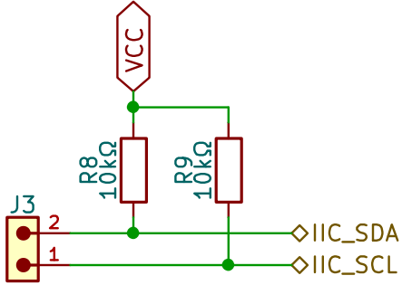{ width=30% }

Die IIC Pins von dem Mikrocontroller wurden auf die Platine frei zugänglich gemacht, sodass die Erweiterungsmöglichkeiten in Form eines Sensors oder Ähnliches einfacher zu implementieren sind. Momentan bleiben die unverbunden.  

**Refresh-Knopf**  
Die benötigte Knopf ist auf der [Abildung 7.xx](#_fig_BK_15) dargestellt. Die wird für manuelles Refresh des Displays benutzt.  

Figure: Schaltung von Refresh-Knopf { #_fig_BK_15 }

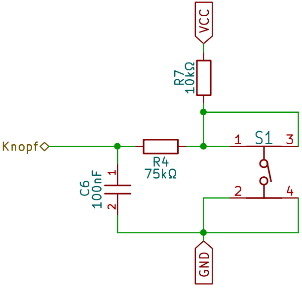{ width=40% }

Wenn ein mechanischer Schalter oder Taster betätigt wird, kann es zu kurzen ungewollten Kontakten kommen, die als Prellen bezeichnet werden. Diese entstehen durch die mechanische Federung und Vibrationen des Schalters. In elektronischen Schaltungen kann dieses Prellen zu Fehlfunktionen führen, insbesondere wenn der Taster als Trigger dient.  
Der verwendete Knopf benötigt eine Entprellschaltung, um zuverlässig zu funktionieren, da er eine maximale Prellzeit von 10 ms aufweist. [[BK_15]](Quellenverzeichnis.md#BK_15)  
Um das Prellen zu beseitigen, wird ein RC-Glied eingebaut, das als Hochpassfilter fungiert. Wenn der Taster offen ist, lädt sich der Kondensator C6 über die Widerstände R4 und R7 auf, wodurch die Spannung langsamer ansteigt. Ist der Taster geschlossen, wird der Kondensator über R4 mit einer kontrollierten Geschwindigkeit entladen. Der Widerstand R7 hat einen Wert von 10 kΩ, da es sich um einen Pull-up-Widerstand handelt. Für R4 wird ein Wert von 75 kΩ gewählt, um in Kombination mit dem Kondensator von 100 nF die gewünschte Zeitkonstante zu erreichen. [[BK_16]](Quellenverzeichnis.md#BK_16)  

**Displayanschlüsse**  
Die dargestellte Ausgänge auf der [Abildung 7.xx](#_fig_BK_16), nämlich den J2 Komponente, sind die Ausgänge, die man direkt mit dem Display über Dupont Pins verbinden kann.  

Figure: Ausgänge für das Display { #_fig_BK_16 }

{ width=20% }

Die erste sieben Ausgänge kömmen direkt von dem Mikrocontroller, wobei der achte Ausgang, konkret den V~cc~ Ausgang, von dem Switch abhängig ist.  

## Platinen Design
**Benjamin Klaric**  
- Über Autorouter reden  
- Über Design Rules von Aisler reden  
- Was für eine Platine von Aisler wir gekauft haben  

## Zusammenbau der PCBs
**Benjamin Klaric**  

## Gehäuse
**Jannis Gröger**

### Anforderungen

Beim Entwurf des Gehäuse für das Low Power Raumdisplay sind die funktionalen Anforderungen einfach gehalten. Da das Gerät im Einsatz später stationär platziert ist, ist es weder mechanischen Stößen noch einer Art von Vibration zu schützen. Zudem wird es nicht in der Hand bedient, weshalb es auch keinen mechanischen Druck ausgesetzt ist. Daher ist nicht auf ein besonders robustes Material zu achten.

Da der Einsatzort hauptsächlich im Gebäudeinneren vorgesehen ist,  ist ein Schutz gegen jegliche Art von Wasser zu vernachlässigen. Da das Display als Bendienung zwei Benutzerknöpfe besitzt, muss das Gehäuse gegen Berühren mit Fingern geschätzt werden, also sollte der Schutz gegen Berührung mindestens der Schutzart zwei zugeordnet werden können. [[JG_02]](Quellenverzeichnis.md#jg_02)

Die Low Power Raumanzeige besitzt elektronische Komponenten, die keine großen Wärmemengen produzieren. Lediglich beim Laden der Akkupacks könnte ein kritische Wärmemenge entstehen, weswegen diese leicht aus dem Gehöuse entfernbar sein sollten, dass beim Laden genug Abwärme durch natürliche Konvektion gegeben ist.

Da die Informationsanzeige mit WLAN mit dem Gerät des Betreibers kommunziert, sollte das Gehäuse die Komponenten nicht zu sehr elektromagnetisch von außen abschirmen und auch elektromagnetische Felder nach außen hin zulassen, da ansonten die Kommunkation gestört werden und das Displaymodul nicht mehr seine volle Funktionsfähigkeit aufweisen kann.

### Design

Zum Entwickeln des 3D-Modells wird die CAD-Software "Autodesk Fusion" genutzt. Das Vorgehen hierbei besteht primär aus der Erstellung einer Skizze, aus der dann verschiedene Fläche extrudiert werden. Um komplexere Konstruktionen zu erlauben, wird dieses Vorgehen wiederholt, wobei die Skizzenfläche eine Oberfläche einer bereits vorhandenen Extrusion ist. Die beiden Gehäuse bestehen jeweils aus drei Teilen:

* Einer Front, in der das Display sitzt
* Einer Halterung für die Platinen des Displays, die an der Front angebracht wird
* einer Rückseite, in der an der Rückwand die Halterungen für Akkupack und selbst entworfener Platine befestigt sind.

Diese Teile werden jeweil mit Gewindeschrauben mit 2,5mm durchmesser verbunden. Die Rückseite kann konstruktionstechnisch nochmal in einen Quader für elektronische Bauteile und einer Schale für das Display unterteilt werden. Diese Teile sind jedoch fest an ihren Kanten verbunden (vgl ABB !!!!!!!!!!!!!!!!!!!!!!). Im folgenden werden die einzelnen Merkmale, die dem Gehäuse hinzugefügt werden, erläutert.

Um die einzelnen Komponenten im Inneren des Gehäuses zu fixieren, müssen für jede einzelne eine spezifische Halterung angefertigt werden. Die Akkupacks werden durch vier L-förmige Säulen, die jeweils eine Ecke der Packs umschließen, vor dem Hin und Herrutschen bewahrt. Das Herausfallen nach Vorne verhindert ein Steg, der mit zwei Schrauben über dem Akkupack angebracht wird. Die Platine wird durch zwei gegenüberliegende Nuten in der Unterseite des Gehäuses und einer konstruierten Wand im Gehäuse gehalten, indem sie seitlich in die Nuten eingeschoben wird. Hierbei wird an der Seite des Gehäuses eine Bohrung angebracht, um auch im montierten Zustand der Low Power Raumanzeige Zugang zum USB-C Anschluss des Mikrocontrollers zu haben.

Da das Displaymodul wie oben erwähnt nicht in der Hand gehalten wird sondern fest vor bspw einem Hörsaal einer Hochschule platziert werden soll, werden an der Rückwand des Gehäuses zwei Langloch-Einhängeöffnungen angebracht. Um das Display dann an der Wand aufzuhängen, müssen einfach zwei Schrauben in der Wand eingeschraubt werden. Diese werden in die Öffnungen eingefädelt, dann wird das Displaymodul nach unten geschoben und ist damit an der Wand fixiert. Damit das Displaymodul auch mobil eingesetzt werden kann, wie beispielsweise bei einem Messestand, wird die untere Fläche des Gehäuses angeschrägt, dass man das Display stabil auf einen Tisch stellen kann.

Wie bereits genannt, soll die Bedienung des Low Power Raumdisplays über einen Bentzerknopf gesteuert werden. Um die Benutzerfreundlichkeit zu gewährleisten, wird dieser an der Front des Displaymoduls angebracht, damit er leicht zugänglich und für alle sichtbar ist. Zusätzlich sollen die eingebauten "Boot"- und "Reset"-Knöpfe des ESP32 ebenso benutzbar bleiben, allerdings nur für den System-Administrator. Deshalb werden hierfür kleine Löcher an der Rückseite des Gehäuses angebracht, dass die Knöpfe ähnlich wie beim SIM Karten Slot eines Handys mit Hilfe eines schmalen Werkzeugs gedrückt werden können. Durch die Platzierung auf der Rückseite sind die Löcher zunächst für die Person, die vor dem Display steht, nicht sichtbar, sondern erst dann erreichbar, wenn das Displaymodul von der Wand genommen wird.

Damit die Software des ESP geflasht werden kann, beispielsweise nach Aktualisierung der Firmware, ohne dabei das Displaymodul auseinanderzubauen, wird an der Seite des Gehäuses eine Bohrung vorgenommen, sodass der USB-C Port des Mikrocontrollers jederzeit zugänglich ist.

Die Halterungen für die Platinen der Beiden Epaper-Displays sind einfache Konstruktionen aus schmalen Stegen, die zylinderförmige Extrusionen besitzen, um die Platinen festzuschrauben. Hierbei unterscheiden sich die beiden Halterungen in ihren Dimensionen, da nicht nur die beiden Displays selbst, sondern auch die zugehörigen Platinen unterschiedliche Maße besitzen.

Die Front des Gehäuses besitzt einen rechteckigen Ausschnitt mit einer Falz nach innen, in die das Display dann gelegt wird. Um das Display vor hineinfallen ins Gehäuse zu schützen, wird einmal die Platinenhalterung direkt an der Rückseitige des Displays angebracht und zusätzlich noch kleine Überhänge konstruiert, die das Display von hinten stützen. Desweiteren ist ein rechteckiger Ausschnitt für den Benutzerknopf in der Front vorhanden.

Da im Laufe der Gehäuseentwicklung Protoypen designt und anschließend getestet werden, entstehen mehrere Entwürfe für die Umsetzung. Die folgenden drei Abbildungen [Abbildung 1](#fig_jg_02), [Abbildung 2](#fig_jg_03) und  [Abbildung 3](#fig_jg_04) zeigen die verschiedenen Versionen der Rückseite des 7.3-Zoll-Gehäuses und jeweils die Veränderungen zur vorherigen Version. Die Rückseite des 9.7-Zoll-Gehäuse wurde anschließend nach dem Vorbild des kleineren Gehäuses designt, wie man in [Abbildung 4](#fig_jg_05) sieht. Die beiden Fronten sind zusammen mit dem Platinenhalter und der Abdeckung des Benutzerknopfes schließlich in [Abbildung 5](#fig_jg_06) und [Abbildung 6](#fig_jg_07) zu sehen.

Figure: Die erste Version der 7.3-Zoll-Rückseite. {#Cfig_jg_02}

{width=70%}

Nach der ersten Version des Gehäuses wurde das Design nochmal grundlegend verändert und auch die Befestigung der Akkupacks überdacht. Wie in [Abbildung 1](#fig_jg_02) zu erkennen ist, wurde zunächst vorgesehen, die Akkupacks von außen zugänglich zu machen, um einen leichteren Austausch zu ermöglichen ohne das Gehäuse von der Wand nehmen zu müssen.

Figure: Die zweite Version der 7.3-Zoll-Rückseite. {#fig_jg_03}

{width=70%}

In der zweiten Version ist nun schon mehr das finale Design wiederzufinden. Das Gehäuse wurde an den Stellen, wo nicht die Elektronik im inneren behalten wird, auf einen minimale Dicke reduziert und die Akkupacks befinden sich nun im Inneren, sodass das Gehäuse geöffnet werden muss, um diese zu tauschen.

Figure: Die dritte und finale Version der 7.3-Zoll-Rückseite. {#fig_jg_04}

{width=70%}

In [Abbildung 3](#fig_jg_04) sieht man nun das endgültige Design des Gehäuses. Im Vergleich zur vorherigen Version wurden die Seiten abgeschrägt, um ein noch schmaleren Eindruck des Gehäuses zu erwecken. Zudem wurden die Aufhängelöcher noch versetzt, um den Schwerpunkt des Gehäuses besser auszugleichen.

Figure: Die Rückseite des Gehäuses für das 9.7-Zoll-Epaper-Display.{#fig_jg_05}

{width=70%}

Figure: Die Front des 7.3-Zoll-Gehäuses mit Platinenhalter und Knopfabdeckung. {#fig_jg_06}

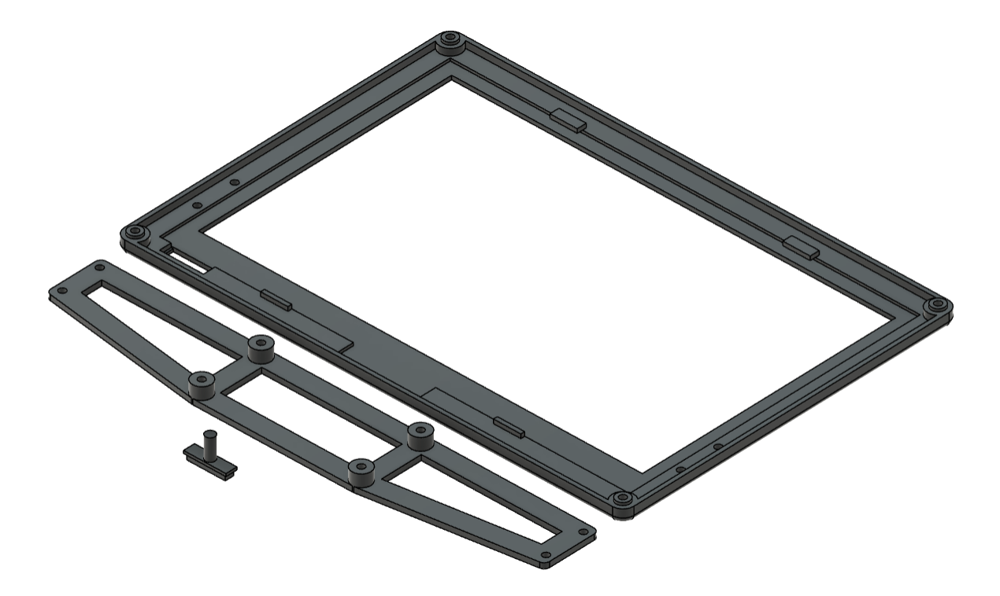{width=70%}

Figure: Die Front des 9.7-Zoll-Gehäuses mit Platinenhalter und Knopfabdeckung {#fig_jg_07}

{width=70%}

Bei der Front des 9.7-Zoll-Gehäuses wurde an der unteren Kante noch eine extra Stützstruktur angebracht, um das Flachbandkabel des Displays kontrolliert zu biegen und ein Ab- oder Einreißen zu verhindern. Zudem deckt der Platinenhalter im Gegensatz zu dem des kleineren Gehäuses einen größeren Teil des Displays ab, da es hier die einzige Art der Unterstützung des Displays von hinten ist.

### Prototyping

Da es sich bei dem LoW Power Raumdisplay um eine Projektarbeit handelt und zunächst keine Serienproduktion vorgesehen ist, beschränkt sich die Entwicklung des Gehäuses auf den Entwurf zweier Prototypen, einmal mit einem 1.3-Zoll-Display und einmal mit einem 9.7-Zoll-Display. Hierbei wird das Rapid-Prototyping-Verfahren des Fused-Deposition-Modelling angewandt, da es neben geringen Kosten auch genug Stabilität für die genannten Anforderungen aufweist. Zudem ist es dem Projektteam möglich, direkt im eigenen Labor der Technischen Hochschule Augsburg dieses Verfahren anzuwenden. Es werden mehrere sogenannte FDM-Drucker zur Verfügung gestellt, ebenso wie die CAD-Software Inventor-Softwarepaket der Firma Autodesk. [[JG_04]](Quellenverzeichnis.md#jg_04)

Die verwendeten FDM-Drucker, im Folgenden auch 3D-Drucker genannt, beschränken sich auf die Modelle 2 Extended+, 3 und S5 der Marke UltiMaker. Diese Drucker verwenden Filamente aus Polyactiden, kurz PLA, oder Polyethylenterephtalat mit Glykolmodifikation, auch PETG genannt mit einem Durchmesser von 2,85mm2. Die Materialien unterscheiden sich nur leicht in ihren Eigenschaften, wobei PETG stabiler und haltbarer ist, PLA dagegen ist hitzebeständiger und biologisch abbaubar.[[JG_05]](Quellenverzeichnis.md#jg_05) Beide Materialien sind in ihrer Stabilität und Hitzebeständigkeit für den Zweck des Low Power Displays ausreichend.

Nachdem die Modelle der Gehäuse im CAD Programm entworfen wurden, werden sie als .stl Dateien in einen sogenannten Slicer exportiert. Ein Slicer übernimmt die Aufgabe des Slicings, wobei ein 3D-Modell in einen für 3D Drucker verständlichen Maschinencode Namens G-Code umgewandelt wird. Zusätzlich können verschiedene Einstellungen vorgenommen werden, die die Druckqualität beeinflussen, wie beispielsweise Druckgeschwindigkeit oder Schichtdicke. [[JG_06]](Quellenverzeichnis.md#jg_06)

Bei diesem Projekt wurde die Slicing Software Cura verwendet, welche ebenfalls von der Marke UltiMaker stammt. Als Schichthöhe werden Werte zwischen 0.1 und 0.2 mm bevorzugt. Bei der Schichtdicke gilt, je kleiner, desto besser ist die Oberflächengüte des Modells, allerdings wird dann auch mehr Zeit für den Druck benötigt.[[JG_06]](Quellenverzeichnis.md#jg_06)

Ein weiterer einstellbarer Wert der mit der Schichtdicke zusammenhängt, ist die Dicke des Bodens und der Decke. Hier wird festgelegt, wie viele Schichten flächendeckend gedruckt werden sollen, bevor die Füllung des Modells beginnt. Ein ähnlicher Wert ist die Wandstärke, wobei hier die Anzahl der vertikalen Schichten ausgewählt wird.[[JG_06]](Quellenverzeichnis.md#jg_06)

Bei der Füllung von Hohlräumen des Modells kann aus der Art und geometrischen Form der Füllung und der prozentualen Menge gewählt werden. Zudem kann noch die Art der Stützen bei Überhängen, sowie die Platzierung und der Winkel des Überhangs gewählt werden, der noch ohne Stütze gedruckt werden kann, bestimmt werden.[[JG_06]](Quellenverzeichnis.md#jg_06)

Um zu einen besseren Halt der Modells auf der Grundfläche des Drucker zu gewährleisten, gibt es verschieden Möglichkeiten zur Auswahl. Ein sogenannter Brim fügt beim Drucken den Außenkanten der Grundfläche eine einzelne Schicht bestimmter Breite hinzu, was die Verbindungsfläche zwischen Druck und Grundfläche erhöht. Ein Raft ist eine Art Polster zwischen dem gesamten Modell und der Druckplatte, was ein nachträgliches Verziehen des Modells durch Erkaltung des Materials verhindert. Eine letzte Variante ist ein Skirt, eine Linie auf der ersten Schicht um die Konturen der Grundfläche. Da diese nicht mit dem Modell verbunden ist, hat diese Variante keinen Einfluss auf Stabilität oder Verziehen des Drucks.[[JG_06]](Quellenverzeichnis.md#jg_06)

Zusätzlich zu den bisher genannten Einstellungen, können noch weitere Parameter für den Druck bestimmt werden, diese werden jedoch nicht genauer erläutert und es werden die gegebenen Standardwerte der Slicer-Software genutzt. Die gewählten Werte der genannten Steuergrößen können der Tabelle  entnommen werden.

 

Table: Tabelle x.x: Parameterwerte für 3D Druck der Gehäuseprototypen. {#tab_jg_01}

| Parameter | Wert |
|:---------:|:--------:|
| Schichthöhe | 0.2 mm |
| Boden-/Deckenstärke | 1.2 mm | 
| Wandstärke | 0.8 mm |
| Füllung | Gyroid, 20% |
| Stützsturktur | Baum, überall, 60° |
| Verbdg Druckplatte | Skirt |

Nach dem Slicen wird der G-Code an den 3D-Drucker übergeben. Hier muss dann nur noch das passende Filament einsetzen und der Druck kann starten. Nach dem Ablösen des fertigen Modells von der Druckplatte wird teilweise noch mit Hilfe eines Skalpells nachgearbeitet, um die Ungenauigkeiten des Druckers auszugleichen. Anschließend werden die Teile auf Passgenauigkeit für die Komponenten getestet und dann die bereits oben genannten Änderungen vorgenommen. 
In [Abbildung 7](#fig_jg_08) sieht man den Zwischenstand eines Drucks. Neben dem Gehöuse selbst ist auch die Stützstruktur in Form der Bäume sehr gut zu erkennen. 

Figure: Zwischenstand beim Drucken des 7.3-Zoll-Gehäuses. {#fig_jg_08}

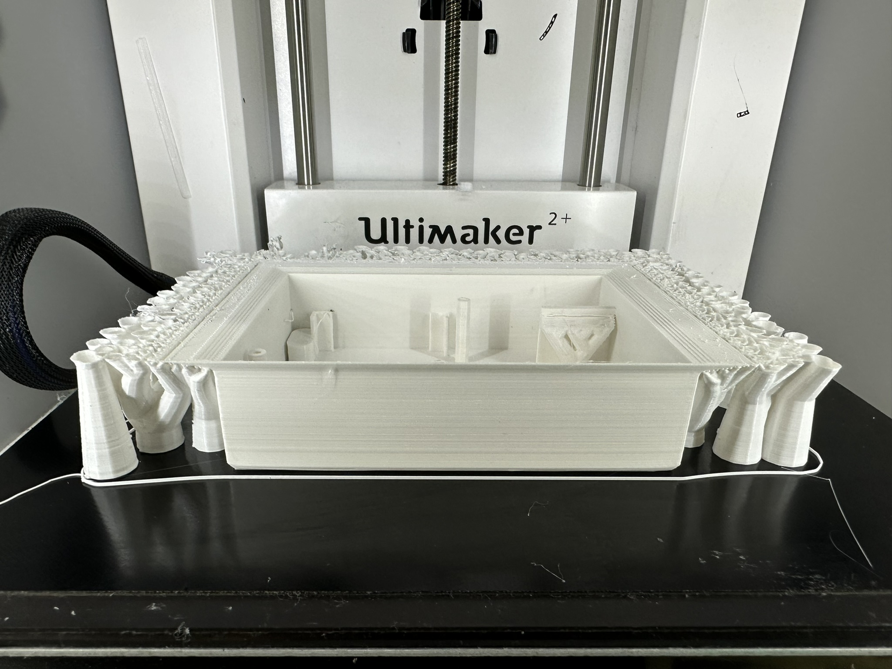{width=70%}

Nach dem Fertigen des finalen Prototyp Gehäuses werden die elektronischen Komponenten eingesetzt und das Displaymodul zusammengebaut. Die fertigen Prototypen kann man in [Abbildung 8](#fig_jg_09) und [Abbildung 9](#fig_jg_10) betrachten.

Figure: Das finale Prototyp-Gehäuse des 9.7-Zoll-Gehäuses. {#fig_jg_09}

{width=70%}

Figure: Das finale Prototyp-Gehäuse des 7.3-Zoll-Gehäuses. {#fig_jg_10}

{width=70%}

## Zusammenbau des Displaymoduls

## Strommessung von Mikrocontroller und Display
### Versuchsaufbau
**Mario Wegmann**

Der Prozess, um ein Bild per WLAN zu empfangen, zu verarbeiten und es auf einem ePaper Display darzustellen, ist sehr umfangreich und während der verschiedenen Phasen ist der Stromverbrauch sehr schwankend. Daher kann mit einer statischen Strommessung kein aussagekräftiges Messergebnis produziert werden. Um den Strom dynamisch zu messen und dabei schnelle Änderungen sichtbar zu machen, eignet sich daher ein Oszilloskop als Messinstrument. Da das Oszilloskop jedoch nur Spannungen messen kann, muss hier der Umweg über einen Shunt-Widerstand gemacht werden. Der Shunt-Widerstand wird dabei in Reihe zwischen der zu messenden Last und der Masse geschaltet, mit einem Tastkopf an beiden Enden des Shunt-Widerstands verbunden, kann nun der Spannungsabfall über den Shunt-Widerstand gemessen werden. Abschließend kann über das Ohm'sche Gesetz aus dem Widerstandswert und der Spannung der durchflossene Strom berechnet werden. Viele Oszilloskope bieten daher auch die Möglichkeit an, die Achsenbeschriftung auf mA umzuschalten, um Messergebnisse mit der korrekten Einheit festhalten zu können. Es muss jedoch beachtet werden, dass das Oszilloskope nicht automatisch das Ohm'sche Gesetz anwendet, da es keine Kenntnis über den Widerstandswert hat. Somit muss dies bei den Messergebnissen mit verrechnet werden oder alternativ darauf geachtet werden, dass der Widerstand wert des Shunt-Widerstands 1 Ω so genau wie möglich erreicht. Des Weiteren ist unbedingt darauf zu achten, dass der Shunt-Widerstand zwischen Last und Masse hängt, wenn es sich um eine netzbetriebene Schaltung handelt. Zwar wäre das Messergebnis theoretisch auch korrekt, jedoch würde durch die Erdung der Masse am Tastkopf ein Kurzschluss entstehen, wenn die Masse vom Tastkopf mit einem anderen Spannungspegel, als der Masse der Schaltung, verbunden wird. Dieser Kurzschluss könnte das Oszilloskop beschädigen. 

In  erkennt man den Versuchsaufbau für die Messung. Als Spannungsquelle dient ein Labornetzteil. Vom Pluspol des Labornetzteils führt ein Draht zum V~cc~ Pin des ESP32. Von GND des ESP32 führt ein Draht zum 1 Ω Shunt Widerstand. An diesem ist auch der Tastkopf des Oszilloskopes angeschlossen. Nach dem Shunt Widerstand führt ein Draht zu einem Multimeter. Das Multimeter dient zur Kontrolle, ob die vom Oszilloskop ausgegebenen Werte plausibel sind. Abschließend ist der zweite Kontakt vom Multimeter mit dem Minuspol des Labornetzteils verbunden. 

Figure: Der Versuchsaufbau mit Oszilloskop, Multimeter und Labornetzteil { #_fig_MW_01 }

{ width=80% }

### Messergebnisse
**Mario Wegmann**  

In [Tabelle 7.xx]( #_tab_MW_02 ) kann man einen kompletten Refresh des 7,3 Zoll großen Displays erkennen. Hierbei wird auf dem ePaper Display zuerst weiß gestellt, anschließend wird nach einer Pause eine in der Firmware hart codierte Bitmap auf dem Display angezeigt. Zum Abschluss wird erneut ein weißes Bild dargestellt. In diesem Teilversuch wurde der Stromverbrauch vom WLAN noch nicht gemessen. Für diesen Versuch wurde Democode von Hersteller WaveShare verwendet, welcher in der Quelle zu finden ist [[MW_09]](Quellenverzeichnis.md#MW_09).

Table: Der Stromverbrauch aufgeteilt in Zeitabschnitte beim 7,3" Display { #_tab_MW_02 }

| Bereich | Zustand	| Avg. Strom  [mA] |	Zeit [s] |
|-|-|-|-|
| 1.  | Bitmap an ePaper Display übertragen	| 66,13 |	1,032 |
| 2.  | Bildschirminhalt leeren	| 64.05 |	1,624 |
| 3.  | Bildschirminhalt leeren	| 74,64 |	2,608 |
| 4.  | Bildschirminhalt leeren	| 73,67 |	2,689 |
| 5.  | Bildschirminhalt leeren	| 66,06 |	3,675 |
| 6.  | Bildschirminhalt leeren	| 62,05 |	2,214 |
| 7.  | Delay	| 48,99 |	0,994 |
| 8.  | Bitmap an ePaper Display übertragen	| 66,77 |	2,196 |
| 9.  | Bitmap darstellen	| 70,51 |	1,847 |
| 10. |  Bitmap darstellen	| 82,34 |	2,653 |
| 11. |  Bitmap darstellen	| 82,03 |	2,703 |
| 12. |  Bitmap darstellen	| 70,94 |	3,695 |
| 13. |  Bitmap darstellen	| 66,15 |	2,009 |
| 14. |  Delay	| 49,19 |	3,001 |
| 15. |  Bitmap an ePaper Display übertragen	| 67,69 |	2,021 |
| 16. |  Bildschirminhalt leeren	| 62,90 |	1,785 |
| 17. |  Bildschirminhalt leeren	| 73,83 |	2,728 |
| 18. |  Bildschirminhalt leeren	| 73,51 |	2,604 |
| 19. |  Bildschirminhalt leeren	| 65,99 |	3,646 |
| 20. |  Bildschirminhalt leeren	| 61,93 |	2,120 |
| 21. |  Delay	| 49,09 |	2,008 |
| 22. |  Deep-sleep	| 9,777 |	5,001 |

**Benjamin Klaric**  

In [Abbildung 7.xx](#_fig_BK_20) sind die geplotteten Werten von der [Tabelle 7.xx]( #_tab_MW_02 ) grapisch dargestellt.

Figure: Plot von dem Stromvebrauch in Zeitabschnitten beim 7,3" Display { #_fig_BK_20 }

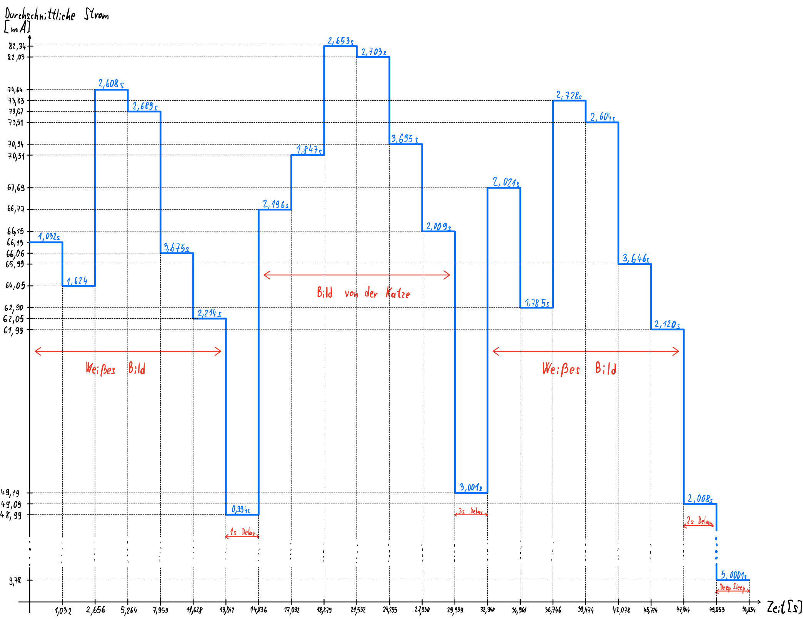{ width=90% }

**Mario Wegmann**  

In [Tabelle 7.xx]( #_tab_MW_9_7_Strom ) sieht man die Messwerte vom Stromverbrauch beim 9,7 Zoll Display. Hierbei wird der ESP32 und das zugehörige Treiber-Board mit Strom versorgt, anschließend das Treiber-Board initialisiert und nach den Eigenschaften des angeschlossenen ePaper Displays gefragt. Erst danach wird die Bitmap zuerst an das Treiber-Board übertragen und dann vom Treiber-Board auf das Display. Abschließend wird das Treiber-Board in den Idle wieder gesetzt und zum Schluss der ESP32 zusätzlich in den Deep-sleep. Für diesen Versuch wurde Democode von GitHub verwendet, welcher in der Quelle zu finden ist [[MW_10]](Quellenverzeichnis.md#MW_10).

Table: Der Stromverbrauch aufgeteilt in Zeitabschnitte beim 9,7" Display { #_tab_MW_9_7_Strom }

| Bereich | Zustand	| Avg. Strom  [mA] |	Zeit [s] |
|-|-|-|-|
| 1.	| Idle mit angeschalteten Treiber-Board  |67,54|	0,929|
|2.	| Init des Treiber-Boards |94,87|	0,948|
|3.	| Auslesen der Informationen des angeschlossenen ePaper Displays |112,2|	0,497|
|4.	| Übertragen der Bitmap über SPI an das Treiberboard |103,4|	0,460|
|5.	| Übertragen der Bitmap an das Display |105,2|	0,570|
|6.	| Bildschirminhalt auf dem ePaper Display darstellen |109,9|	0,865|
| 7. | Idle mit angeschalteten Treiber-Board  |66,48|	0,954|
| 8.	| Deep-sleep angeschalteten Treiber-Board | 29,22 |	5,002|

**Benjamin Klaric**  

In [Abbildung 7.xx](#_fig_BK_21) sind die geplotteten Werten von der [Tabelle 7.xx]( #_tab_MW_9_7_Strom ) grapisch dargestellt.

Figure: Plot von dem Stromvebrauch in Zeitabschnitten beim 9,7" Display { #_fig_BK_21 }

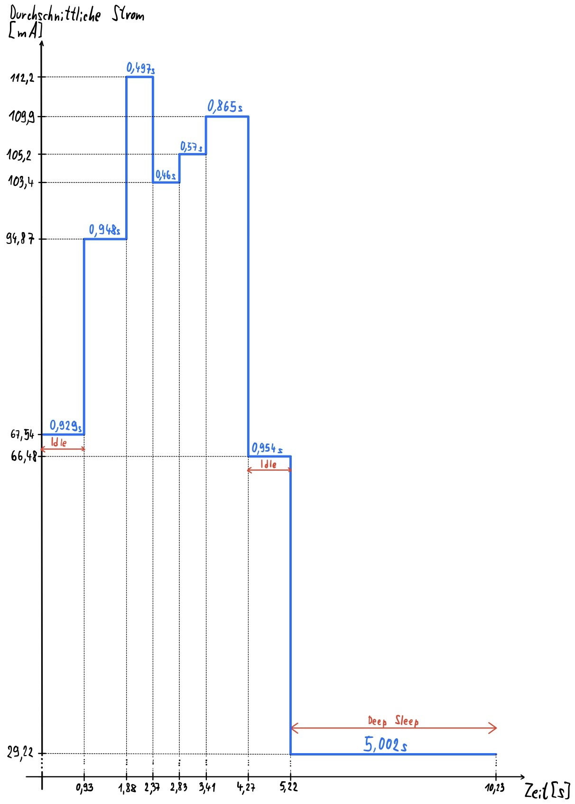{ width=60% }

### Interpretation
**Benjamin Klaric**  

Der Stromvebrauch sowohl von dem 7,3 Zoll als auch von dem 9,7 Zoll liefern eine angemessene Vebrauch im Zeit von einen vollen Refresh. Es gibt aber ein paar Sachen die man berücksichtigen muss, nämlich die Tatsache, dass ein vollen Refresh nicht jedes Mal durchgeführt sein muss und das der Stromvebrauch zusammen mit WiFi funken nicht in diesem Aufbau gemossen war.  
Die Erklärung, das den vollen Refresh nicht jedes Mal gemacht sein muss, liegt an den Spezifikationen von dem Display. Ein Display soll nach eine längere Zeit ohne Refresh, ein vollen Refresh bekommen. [[BK_20]](Quellenverzeichnis.md#BK_20) Das verringert die Zeit, wo das System mit vollen Last arbeitet und damit auch den durchscnittliche Verbrauch.  
Den WiFi Verbrauch wurde nicht berucksichtigen, da dieser Verbrauch von vielen Parametern abhägig war, die in der Zeit von Strommessung noch nicht festgegeben sein konnten, wie der Optimierung von Code, der WiFi Nutzung ansteuert und die Tatsache, dass das Modul, die für Strommesung benutzt war, später nicht mehr benutzt wurde, wegen höhen Stromverbrauch in Deep Sleep Modus.  
In nächsten Abschnitt erfolgt ein genaueren Blick auf gemessenen Werten und deren Bedeutung.  

**Stromverbrauch von 7,3" Display**  
Das 7,3" Display hat eine längere Refresh-Zeit, was darauf zurückzuführen ist, dass es vier anstatt zwei Farben darstellen kann. Diese zusätzliche Farbunterstützung führt zu einer längeren Arbeitszeit und somit zu einem erhöhten Stromverbrauch. Der durchschnittliche Stromverbrauch des Displays kann anhand des Plots aus [Abbildung 7.xx](#_fig_BK_20) berechnet werden. Dieser liegt bei 62 mA über einen Zeitraum von 54,853 Sekunden, wobei der Verbrauch stark von der Länge der Arbeitszeit abhängt.  
Durch den Verzicht auf einen vollständigen Refresh und die Nutzung eines Mikrocontrollers wie dem XIAO ESP32-S3, der im Deep-Sleep-Modus einen sehr geringen Stromverbrauch von 14 μA im Vergleich zu 9,78 mA aufweist, kann der durchschnittliche Stromverbrauch des Systems signifikant reduziert werden. Dies führt zu einer effizienteren Nutzung und einer Verringerung des Gesamtenergiebedarfs über längere Zeiträume.  

**Stromverbrauch von 9,7" Display**  
Das 9,7-Zoll-Display zeichnet sich durch eine sehr kurze Refresh-Zeit aus, was jedoch zu einem höheren Stromverbrauch bei jedem Refresh führt. Über einen Zeitraum von 4,885 Sekunden beträgt der durchschnittliche Stromverbrauch 97 mA. Dieser erhöhte Durchschnittsverbrauch wird durch die verkürzte Betriebszeit ausgeglichen.  
In  wird verdeutlicht, dass trotz des höheren Stromverbrauchs des 9,7-Zoll-Displays der Gesamtenergieverbrauch aufgrund der schnellen Refresh-Zeit kompensiert wird.  

## ADC Messung
**Benjamin Klaric**  

[Abildung 7.xx](#_fig_BK_21)  

Figure: Plot von 50 Messwerten bei jedem Spannungspegel { #_fig_BK_21 }

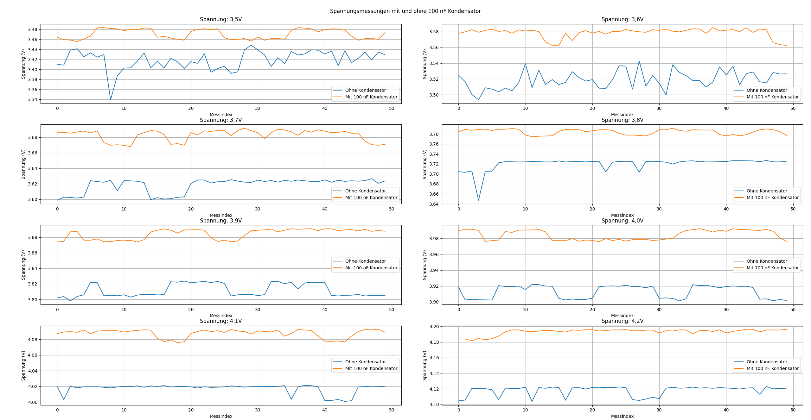{ width=100% }
