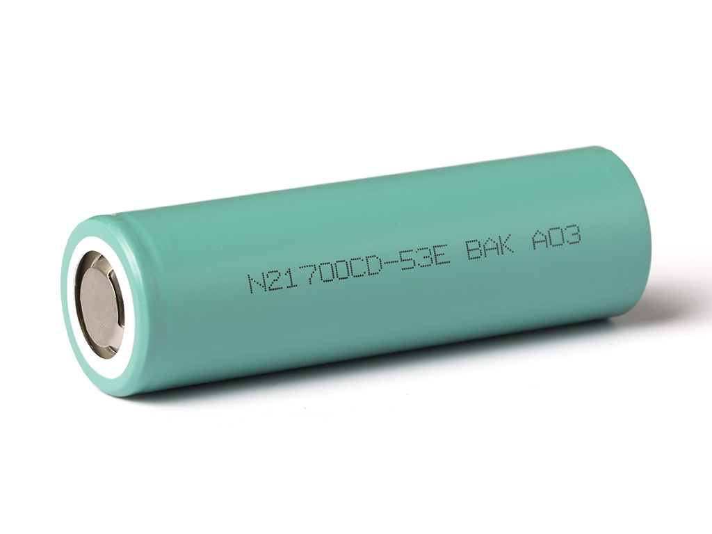
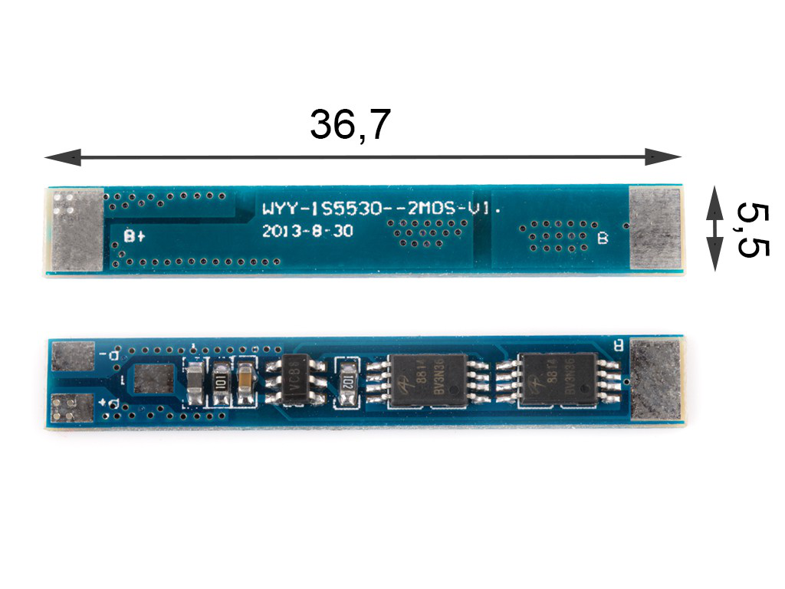

# Hardware

## Auswahl des Mikrocontrollers
- GPIO’s
- Stromverbrauch
- Vorteile (Charger, …)
- Bauform
- Speicher

## Auswahl der Displaytechnologie

## Auswahl der Akkukomponenten
#### Akku
Der ausgewählte Akku, aus verschiedenen Akku-Technologien, die in Kapitel 2 genannt waren, war der klassische Li-Ion-Akku, aus mehreren Gründen. Aufgrund der Anzahl und Position des Systems, die von Akku betrieben sein wurde, war der Sicherheitsaspekt ein entscheidender Faktor. Deswegen wurden die LiPo-Akkus nicht mehr betrachtet.  
Der Vergleich zwischen Li-Ion-Akkus und LiFePo~4~-Akkus hatte eindeutige Unterschiede geliefert. Die LiFePo~4~-Akkus repräsentieren die sicherste Variante, andererseits hatten die Li-Ion-Akkus eine höhere Nennspannung von 3,7V.  
Aus Sicherheitsblick betrachtet wurden die LiFePo~4~-Akkus ausgewählt. Die Nennspannung von 3,2V hat jedoch gegen die LiFePo~4~-Akkus gesprochen, da der ausgewählte Mikrocontroller, nämlich den XIAO ESP32-S3, Betriebsspannung zwischen 3,2V und 4,2V angefordert hat. Obwohl die LiFePo~4~-Akkus die Betriebsspannung liefern konnten, konnten sie das System nicht betreiben, da die genannte Betriebsspannung in Fall ohne schwere Last gemeint ist. Wegen dies wurden allerdings die Li-Ion-Akkus gewählt.  
Der nächste Schritt war, eine vernünftige Kapazität zu finden, sodass die Akkus das System lang genug betreiben konnten. Dazu hat man die Schätzungen mit Verbrauchmessungen unterstützt und ungefähr die benötigte Akku-Kapazität geschätzt. Eine Akkulaufzeit von einem Jahr war gewünscht und dementsprechend war die Große des Akkus gewählt, nämlich ~10000 mAh.  
Ein Akku mit so einer Kapazität war aber nicht einfach zu finden. Deswegen wurde das Akkupack aus zwei ~5000 mAh Akkus gebaut. Um von zwei ~5000 mAh auf die gewünschte Kapazität zu kommen, wurden die Akkus in parallel verbunden, da so die Kapazität sich verdoppelt; im Vergleich, wenn man die in Reihe anschließt, so wird die Spannung verdoppelt.  
Bei der Suche nach Akkus muss man einige Sachen beachten. Der Formfaktor der Akku, minimale Kapazität, ob der Akku schon ein eingebautes BMS hat und der Entladestrom.  
Es würde die BAK N21700CD-53E ausgewählt, die auf  zu sehen ist.

Figure: Li-Ion-Akku [[BK_09]](Quellenverzeichnis.md#bk_09) { #_fig_akku }

{ width=60% }

Aus der Tabelle der technischen Daten auf der  des betrachteten Akkus ist es klar zu sehen, dass alle benötigten Parameter erfüllt sind. Der Formfaktor ist aus der Durchmesser und Höhe (die ersten zwei Ziffern von Durchmesser und normalerweise erste drei Ziffern von Höhe → 21700).  

Figure: Technische Daten von BAK N21700CD-53E [[BK_10]](Quellenverzeichnis.md#bk_09) { #_fig_akku_tabelle }

{ width=60% }

#### BMS
Um den Akkupack sicher betreiben zu können, wurde ein BMS benötigt. Wie bereits in Kapitel 2 unter Akku-Technologien erwähnt, schützt ein BMS die Akkus vor Tiefentladung, Überladung, Kurzschluss und Überstrom.  

Beim genaueren Blick auf ein 1S-BMS, auf , wo 1S die Anzahl der Zellen in Serie repräsentiert, erkennt man ein IC und zwei NMOS-Transistoren. Die NMOS-Transistoren dienen als Schalter, die vom IC durch Gate-Spannung angesteuert werden.  

**Überladungsschutz**: Wenn die Ladespannung 4,2V überschreitet, sendet der IC ein Signal, das die Gate-Spannung eines NMOS-Transistors steuert, wodurch dieser den Stromkreis unterbricht.  

**Tiefentladungsschutz**: Bei Tiefentladung wird ein ähnlicher Mechanismus aktiviert, allerdings bei 2,5V. Der IC sendet ein Signal an den zweiten NMOS-Transistor, um den Stromfluss zu unterbrechen, sobald die Spannung einen kritischen Wert erreicht.  

**Überstromschutz**: Der IC überwacht den Stromfluss kontinuierlich. Wenn der Strom über den zulässigen Grenzwert steigt, schaltet der IC einen der NMOS-Transistoren ab, um den Stromfluss zu unterbrechen und die Batterie vor Schäden zu schützen.  

**Kurzschlussschutz**: Auch bei einem Kurzschluss, bei dem sehr hohe Ströme fließen, erkennt der IC diese Situation und unterbricht sofort den Stromfluss durch Abschalten der NMOS-Transistoren.  

Das BMS, das auf  dargestellt ist, liefert alle diese Features und wurde für den Aufbau von dem Akkupack ausgewählt.  

Figure: Li-Ion-Akku [[BK_11]](Quellenverzeichnis.md#bk_11) { #_fig_akku }

{ width=60% }

#### Ladegerät
Wie bereits in Kapitel 2 unter Akku-Technologien erwähnt, benötigen die Li-Ion-Akkus ein spezielles Ladegerät, nämlich ein Ladegerät, der in die Lage ist beim Laden der Akkus, erste 80% konstanter Strom zu liefern und danach 20% die Akkus mit konstanter Spannung zu laden. 
Man kann solche Ladegeräten ohen viele Schwierigkeiten finden, sind allerdings teuer. Bei der Suche nach einen muss man eine Sache beachten, nämlich den Zellenanzahl. Die ausgewählte Ladegerät ist auf die  zu sehen.

Figure: Ladegerät für Li-Ion-Akkus [[BK_12]](Quellenverzeichnis.md#bk_12) { #_fig_ladegeraet }

{ width=60% }

## Zusammenbau der Akkupacks
**Mario Wegmann**
//TODO
Warum Nickelband?
Grafiken Aufbau Akkuzellen
Quellen
Nickelband
Punktverschweißen

### Konzeptioneller Aufbau

Bei der Auswahl der Akkukomponenten wurde die Entscheidung getroffen mehere Lithium-Ionen Zellen zu verwenden. Da die Kapazität des Akkupackts vergrößert werden, die Batteriespannung jedoch weiterhin zwischen 2,5 V und 4,2 V liegen soll, werden die beiden Lithium-Ionen Zellen parallel mit einander verbunden. Dadurch verdoppelt sich die Kapazität, während die Spannung gleich bleibt. Zudem wird der gemeinsame Pluspol mit dem Plus des Battery Management System verbunden und ebenso mit dem Minuspolen verfahren. Zum verbinden von den Akkuzellen untereinander und mit dem BMS eignet sich ein Nickelband, welches auch als Hiluminband bekannt ist. Nickel hat die Eigenschaft sich gut verschweißen zu lassen. 

### Battery Management System anschließen
Als erstes sollte das BMS verdrahtet werden. In diesem Projekt wurde sich dafür entschieden, dass das Akkupack über einen Stecker mit dem Mainboard verbunden werden kann und somit modular ist. Somit wurde an den Ausgängen des BMS ein 2 Pin JST-X2 Stecker gelötet. Hierbei wurde sich im Team intern darauf geeinigt, das der Pluspol rechts ist, wenn von der Drahtseite auf den Stecker geschaut wird und die Nase des Steckers nach oben zeigt. An den Pads für die Batteriepole wurde das Nickelband ebenso verlötet. 

### Vorbereiten der Lithium-Ionen Zellen
Für einen sicheren Umgang mit Lithium-Ionen Zellen ist es wichtig mehere Dinge zu beachten, bevor mehere Zellen miteinander verbunden werden können. 
Bereits beim beschaffen von den Zellen sollte darauf geachtet werden das identische Modell und eine gleiche Charge zu verwenden. 
Zudem sollten Zellen, die verbunden werden sollen, möglichst gleich alt und auch gleich belastet werden oder im optimalfall komplett neu sein. 
Zuletzt sollte vor dem Verbinden darauf geachtet werden, dass die Zellen die gleiche Zellspannung aufweisen um einen schlagartigen Ladungswechsel beim verbinden vorzubeugen.

Nachdem die einzelnen Zellen vorbereitet waren, wurden diese in die Plastikhalter eingelegt. Diese Plastikabstandshalter ergeben zusammen mit den Zellen ein stabiles Gesamtsytem und halten die Zellen davor ab sich direkt zu berühren.  

### Punktschweißverfahren bei Lithium-Ionen Zellen
Lithium-Ionen Zellen sind wärmeempfindlich und daher ist Weichlöten kein geeignetes Verfahren um die Zellen mit dem Hiluminband zu verbinden, stattdessen eignet sich das Punktschweißverfahren. Hierbei wird das Nickelband an einem Pol einer Zelle gepresst und dann die zwei Elektroden des Punktschweißgerätes auf das Nickelband gedrückt. Durch die beiden Elektroden fließen 1.000 bis 3.000 Ampere bei 2 bis 5 Volt, dieser hohe Strom führt zu einem Schweißpunkt, welcher das Nickelband und den Pol fest verbindet, jedoch aufgrund der kurzen Dauer des Prozesses von circa 5 Millisekunden kaum eine Wärmebelastung für die Akkuzelle darstellt. Das Nickelband, welches bereits mit dem BMS verbunden ist, wurde um ein weiteres Nckelband orthogonal dazu erweitert. Dadurch ergibt sich eine Nickelverbindung in T-Form. An beiden offenen Enden wurde jeweils ein Batteriepol angeschlossen. Dies wurde für die andere Polseite wiederholt. 

### Isolieren des Akkupacks
Abschlißend wurde Kapton Klebeband verwendet um das Akkupack mit einer isolierenden Schicht zu umhüllen. Dadurch wird vermieden, dass unkontrolliert die Batteriepole mit anderen leitfähigen Materialen in berührung kommen und sämtlicher Strom über das BMS geleitet wird. Kapton Klebeband ist dabei ein sehr guter elektrischer und thermischer Isolator. 

## Auswahl der PCB-Komponenten

## Platinen Design

## Zusammenbau der PCBs

## Gehäuse

## Zusammenbau des Displaymoduls

## Strommessung von Mikrocontroller und Display
### Versuchsaufbau
**Mario Wegmann**

Der Prozess um ein Bild per WLAN zu empfangen, zu verarbeiten und es auf einem ePaper Display darzustellen ist sehr umfangreich und während den verschiedenen Phasen ist der Stromverbrauch sehr schwankend. Daher kann mit einer staatischen Strommessung kein aussagekräftiges Messergebnis produziert werden. Um den Strom dynamisch zu messen und dabei schnelle Änderungen sichtbar zu machen eignet sich daher ein Oszilloskop als Messinstrument. Da das Oszilloskop jedoch nur Spannungen messen kann muss hier der Umweg über einen Shunt-Widerstand gemacht werden. Der Shunt-Wiederstand wird dabei in Reihe zwischen der zu messenden Last und der Masse geschaltet, mit einem Tastkopf an beiden Enden des Shunt-Widerstands verbunden, kann nun der Spannungsabfall über den Shunt-Widerstand gemessen werden. Abschließend kann über das Ohm'sche Gesetz aus dem Widerstandswert und der Spannung der durchflossene Strom berechnet werden. Viele Oszilloskope bieten daher auch die Möglichkeit an, die Achsenbeschriftung auf mA Umzuschalten um Messergebnisse mit der korrekten Einheit festhalten zu können. Es muss jedoch beachtet werden, dass das Oszilloskope nicht automatisch das Ohm'sche Gesetz anwendet, da es keine Kenntniss über den Widerstandswert hat. Somit muss dies bei den Messergebnissen mit verrechnet werden, oder alternativ darauf geachtet werden, dass der Widerstandwert des Shunt-Widerstands 1 Ω so genau wie möglich erreicht. Des weiteren ist unbedingt darauf zu achten das der Shunt-Widerstand zwischen Last und Masse hängt, wenn es sich um eine netzbetriebene Schaltung handelt. Zwar wäre das Messergebnis theoretisch auch korrekt, jedoch würde durch die Erdung der Masse am Tastkopft ein Kurzschluss entstehen, wenn die Masse vom Tastkopft mit einer anderem Spannungspegel, als der Masse der Schaltung verbunden wird. Dieser Kurzschluss könnte das Oszilloskop beschädigen. 

In  erkennt man den Versuchsaufbau für die Messung. Als Spannungsquelle dient ein Labornetzteil. Vom Pluspol des Labornetzteils führt ein Draht zum V~cc~ Pin des ESP32. Von GND des ESP32 führ ein Draht zum 1 Ω Shunt Widerstand. An diesem ist auch der Tastkopf des Oszilloskopes angeschlossen. Nach dem Shunt Widerstand führ ein Draht zu einem Multimeter. Das Multimeter dient zur Kontrolle, ob die vom Oszilloskop ausgegebenen Werte plausibel sind. Abschließend ist die der zweite Kontakt vom Multimeter mit dem Minuspol des Labornetzteils verbunden. 

Figure: Der Versuchsaufbau mit Oszilloskop, Multimeter und Labornetzteil { #_fig_MW_01 }

{ width=80% }

### Messergebnisse
**Mario Wegmann**

In  kann man einen kompletten Refresh des 7,6 Zoll großen Displays erkennen. Hierbei wird auf dem ePaper Display zuerst weiß gestellt, anschließend wird nach einer Pause eine in der Firmware hard codierte Bitmap auf dem Display angezeigt. Zum Abschluss wird erneut ein weißes Bild dargestellt. In diesem Teilversuch wurde der Stromverbrauch vom WLAN noch nicht gemossen. 

Table: Der Stromverbrauch aufgeteilt in Zeitabschnitte beim 7,6" Display { #_tab_MW_02 }

| Bereich | Zustand	| Avg. Strom  [mA] |	Zeit [s] |
|-|-|-|-|
| 1.  | Bildschirminhalt leeren	| 66,13 |	1,032 |
| 2.  | Bildschirminhalt leeren	| 64.05 |	1,624 |
| 3.  | Bildschirminhalt leeren	| 74,64 |	2,608 |
| 4.  | Bildschirminhalt leeren	| 73,67 |	2,689 |
| 5.  | Bildschirminhalt leeren	| 66,06 |	3,675 |
| 6.  | Bildschirminhalt leeren	| 62,05 |	2,214 |
| 7.  | Delay	| 48,99 |	0,994 |
| 8.  | Bitmap darstellen	| 66,77 |	2,196 |
| 9.  | Bitmap darstellen	| 70,51 |	1,847 |
| 10. |  Bitmap darstellen	| 82,34 |	2,653 |
| 11. |  Bitmap darstellen	| 82,03 |	2,703 |
| 12. |  Bitmap darstellen	| 70,94 |	3,695 |
| 13. |  Bitmap darstellen	| 66,15 |	2,009 |
| 14. |  Delay	| 49,19 |	3,001 |
| 15. |  Bildschirminhalt leeren	| 67,69 |	2,021 |
| 16. |  Bildschirminhalt leeren	| 62,90 |	1,785 |
| 17. |  Bildschirminhalt leeren	| 73,83 |	2,728 |
| 18. |  Bildschirminhalt leeren	| 73,51 |	2,604 |
| 19. |  Bildschirminhalt leeren	| 65,99 |	3,646 |
| 20. |  Bildschirminhalt leeren	| 61,93 |	2,120 |
| 21. |  Delay	| 49,09 |	2,008 |
| 22. |  Deep-sleep	| 9,777 |	5,001 |

### Interpretation

## ADC Messung