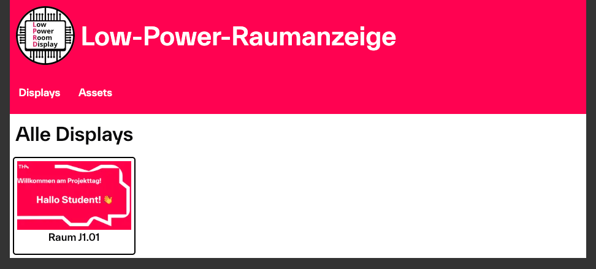
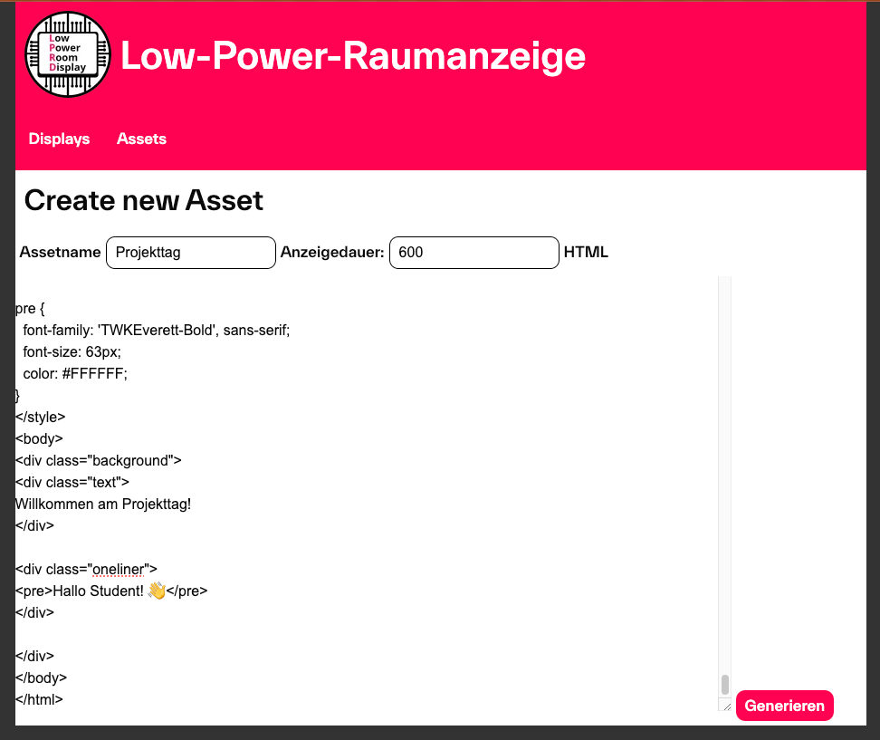

# Webentwicklung
 
## Framework und Library Auswahl

## Konvertierungsverfahren (HTML → PNG → Bitmap)

## Web Bneutzer Oberfläche

## Linux Webanwendung 
**Mario Wegmann**

### Verwendete Technologien

Wie im Kapitel [3.9.1 Webtechnologien](PraktischeUTheoretischeGrund.md#webtechnologien) bereits erläutert, ist es für die Entwicklung einer komplexeren Webanwendung sehr sinnvoll, ein Webframework einzusetzen. 
Hierbei gibt es eine große Auswahl an möglichen Frameworks und auch serverseitigen Programmiersprachen. Da JavaScript bereits im Standalonemodus, wie auch im Netzwerk-Modus, verwendet wird, um die Interaktion mit dem Displaymodul zu realisieren, ist es naheliegend, auch auf dem Server JavaScript zu nutzen. Diese Entscheidung ermöglichte eine einheitliche Codebasis sowohl im Frontend als auch im Backend, was die Entwicklung effizienter und die Wartung der Anwendung einfacher macht und zuletzt auch das Erlernen neuer Programmiersprachen auf eine reduziert. Zudem wurde die Möglichkeit genutzt, TypeScript anstatt JavaScript zu verwenden, um die Vorteile zu nutzen, welche ebenso bereits im Kapitel [3.9.1 Webtechnologien](PraktischeUTheoretischeGrund.md#webtechnologien) erwähnt wurden. 

Für das Frontend wurde React ausgewählt. Durch React lassen sich Komponenten realisieren, welche modular wiederverwendet werden können. Dadurch wird es vermieden, doppelten Code zu verfassen und Änderungen an einer Komponente werden global in der gesamten Webanwendung widergespiegelt. 

Als Webframework wurde Next.js ausgewählt, da es React unter anderem um serverseitiges Rendering erweitert. Darüber hinaus bietet Next.js eine nahtlose Integration von API-Routen und Middleware, was die Entwicklung von Full-Stack-Anwendungen erleichtert. 

Für das Speichern der Daten wurde PostgreSQL als Datenbank ausgewählt. Hierbei wird Prisma ORM als Zwischenschicht eingesetzt, damit die Modelle der relationanlen Datenbank als Objekte mit statischen Typen generiert werden. 

Für den Webserver wurden Linux und Docker verwendet. Das quelloffene Linux ist bekannt für seine Stabilität, Sicherheit und Performance, was es zu einer idealen Wahl für den Einsatz als Webserver macht. Docker ergänzt diese Vorteile durch die Bereitstellung einer containerisierten Umgebung, die eine konsistente und isolierte Ausführung von Anwendungen ermöglicht. Dies erleichtert die Skalierung und Verwaltung der Anwendung erheblich und sorgt dafür, dass sie in unterschiedlichen Umgebungen gleichbleibend funktioniert. Docker-Container bieten zudem eine einfache Möglichkeit, Abhängigkeiten zu verwalten und die Bereitstellung von Updates zu automatisieren. 

Die Kombination dieser Technologien ermöglicht effizient eine benutzerfreundliche, performante und wartbare Webanwendung zu entwickeln. 

Wie die Einzelkomponenten zusammenspielen, ist in  ersichtlich.

Figure: Der Techstack der Webanwendung { #_fig_MW_techstack }

{ width=60% }

Der Code wurde größtenteils in VSCode verfasst und mit der Versionskontrolle git auf GitHub verwaltet. 

### Aufbau der Webanwendung

**Datenbankstruktur**

In der PostgreSQL Datenbank gibt es zwei Tabellen, die erste Tabelle enthält alle Displaymodule, der Aufbau einer Displaymodul-Entität ist in  erkennbar. Hierbei wird als Primary Key die MAC-Adresse verwendet, da diese bei der Produktion vom Hersteller eindeutig vergeben wird, eignet sich diese sehr gut als Primary Key. Des Weiteren werden ein frei definierbarer Anzeigename, die Auflösung des verbauten ePaper Displays, der Zeitpunkt, wann sich das Displaymodul das letzte Mal mit dem Server verbunden hat und das aktuell festgelegte Asset hinterlegt. 
In  ist die Asset-Entität aufgelistet, diese besteht aus einer zufällig generierten cuid für den Primary Key, einer Typenangabe, ob statisch oder dynamisch, einem frei definierbaren Anzeigename, der Dateipfad auf dem Server Dateisystem, dem HTML Code für das Erstellen des Assets, sofern es über HTML generiert wird und die Anzeigedauer. Die PNGs werden lokal auf dem Dateisystem des Servers abgelegt, somit kann die Datenbank einerseits schlank bleiben und der Webserver kann die PNGs einfach ausliefern. 

Die meisten Eigenschaften wurden als optional deklariert, damit die Entitäten auch schon erstellt werden können, auch wenn noch nicht alle Eigenschaften bekannt sind. 

Table: Die Display-Entität { #_tab_MW_Display }

| Key | Type | Eigenschaft |
|-|-|-|
|  mac_adr          | String | MAC-Adresse, Primary Key |
|  friendly_name    | String | Anzeigename, Optional |
|  width            | Int | Breite des Displays |
|  height           | Int | Höhe des Displays |
|  last_seen        | DateTime | Zuletzt gesehen, Optional | 
|  currentAsset     | String | Aktuell anzuzeigendes Asset, Optional |
|  currentAssetType | String | Typ des aktuell anzuzeigenden Assets, Optional |

Table: Die Asset-Entität { #_tab_MW_Asset }

| Key | Type | Eigenschaft |
|-|-|-|
|  id               | String  | Primary Key, cuid Algorithumus |
|  type             | Type | Art des Assets, Optional, Kann "STATIC" oder "DYNAMIC" sein |
|  friendly_name    | String | Anzeigename, Optional |
|  file_path        | String | Pfad auf dem Dateisystem des Servers, Optional |
|  html             | String | HTML Code zum generieren des PNGs, Optional |
|  valid_for        | Int | Anzeigedauer des Assets, Optional |

**Backend**

Für eine standardisierte Verwendung der Daten wurde eine REST-API-Schnittstelle umgesetzt. So können mit GET-Anfragen Daten angefragt, mit PUT-Anfragen Daten bearbeitet und mit DELETE-Anfragen Daten auch gelöscht werden. Sowohl das Frontend als auch die Displaymodule verwenden diese REST-API. 

Eine vollständige Übersicht der möglichen REST-API-Aufrufe ist in Tabelle  ersichtlich. Platzhalter in eckigen Klammern werden dabei dynamisch in der Anfrage berücksichtigt. 

Table: Die Unterstützen REST-API Aufrufe der Webanwendung { #_tab_MW_03 }

| URL | Methode | Body | Rückgabe | Zweck |
|-|-|-|-|-|
| api/v1/assets | GET | - | JSON | Gibt alle vorhandenen Assets in JSON zurück. | 
| api/v1/assets | PUT | HTML Form | JSON | Erstellt ein neues Asset. Falls im HTML Form ein Key `html` enthalten ist, wird der Inhalt als HTML interpretiert und ein PNG davon erzeugt und lokal abgespeichert. Falls im HTML Form eine PNG-Datei enthalten ist, so wird diese lokal abgespeichert. | 
| api/v1/assets/[ID] | GET | - | JSON | Gibt das Asset mit der übergebenen ID als JSON zurück. |
| api/v1/assets/[ID] | PUT | HTML Form | HTTP Status | Aktualisiert die Daten des Assets mit der passenden ID, falls HTML mitgesendet wird, so wird das PNG neu genriert und lokal abgespeichert. |
| api/v1/assets/[ID] | DELETE | - | HTTP Status | Löscht das Asset mit der übergebenen ID.  |
| api/v1/displays | GET | - | JSON | Gibt alle vorhandenen Displaymodule in JSON zurück. | 
| api/v1/displays/[MAC] | GET | - | JSON | Gibt das Displaymodule mit der passenden MAC-Adresse in JSON zurück. | 
| api/v1/displays/[MAC] | PUT | HTML Form oder JSON | HTTP Status | Aktualisiert die Infos des Displaymoduls mit der MAC-Adresse oder setzt das zugewiesene Asset neu.  | 
| api/v1/displays/[MAC] | DELETE | - | HTTP Status | Löscht das Displaymodul mit der MAC-Adresse aus der Datenbank. |
| api/v1/displays/config/[MAC] | GET | - | JSON | Gibt als JSON zurück, welches Asset gerade für das Displaymodul mit der MAC-Adresse zugewiesen ist und wie lange es angezeigt werden soll. |
| api/v1/displays/register/[MAC] | PUT | JSON | JSON | Erstellt das Displaymodul mit der MAC-Adresse neu in der Datenbank und gibt das neu erstellte Displaymodul als JSON zurück. |

**Frontend**

Im Frontend gibt es fünf Unterseiten. Die Startseite enthält das Menü zu den anderen beiden Hauptunterseiten »Displays« und »Assets«. In der Unterseite »Displays« befindet sich eine Auflistung aller dem Server bekannten Displaymodulen. Ein Displaymodul registriert sich dabei beim Server selbst, da es im Servermodus die Register-URL aufruft und sich dem Server so bekannt macht. In  ist erkennbar, dass jedes Displaymodul seinem mit seinem Anzeigenamen und auch einer Vorschau des aktuell zugewiesenen Assets dargestellt wird. Ein Displaymodul kann in der Übersicht angeklickt werden, wodurch sich eine Detailansichtsseite öffnet. In dieser Detailseite, welche  zeigt, können die Metadaten des Displays bearbeitet und gespeichert werden. Zusätzlich werden alle Assets angezeigt, sobald ein Asset angeklickt wird, wird dieses als neues Asset dem Display zugewiesen. 

Figure: Die Übersichtsseite aller Displays { #_fig_WA_Displays}

{ width=60% }

Ähnlich verhält es sich mit der zweiten Hauptunterseite »Assets«, die unter  erkennbar ist. Auch hier werden alle vorhandenen Assets aufgelistet und können ausgewählt werden, um eine Detailansicht, wie in  gezeigt, zu öffnen und die Metadaten zu bearbeiten und das Asset zu löschen. Im Gegensatz zu Displaymodulen können Assets händisch angelegt werden, entweder kann dafür eine PNG-Datei hochgeladen oder HTML-Code eingetragen werden, welcher abschließend wieder ein PNG produziert. Die Abbildungen  und  zeigen jeweils die beiden Vorgänge. 

Figure: Eine Übersicht über alle vorhanden Assets { #_fig_WA_Assets }

{ width=60% }

Figure: Die Detailansicht eines Displays { #_fig_WA_Display_Details}

{ width=60% }

Figure: Das Formular zum hochladen von bestehenden PNGs { #_fig_WA_Upload }

{ width=60% }

Figure: Das Formular zum erstellen von PNGs aus HTML Code { #_fig_WA_HTML }

{ width=60% }

### Testumgebung

Als Testumgebung wurde beim Rechenzentrum (RZ) eine Linux-VM beantragt. Die vom Rechenzentrum erhaltene VM hat die in  genannten Eigenschaften. 

Table: Die Systemeigenschaften der vom RZ erhaltenen VM.  { #_tab_MW_01 }

| Eigenschaft | Wert |
|-------|------|
| Betriebssysrtem | Debian 12 (bookworm) |
| Prozessor-Cores | 2x 2,9 GHz |
| Arbeitsspeicher | 2 GB |
| Hauptspeicher | 30 GB |
| Hostname | lprd |

Zudem wurde vom RZ auch gleich ein DNS-Eintrag gesetzt und die Domain lprd.informatik.tha.de verweist auf diese VM. 
Neben dem Betriebssystem liefert die VM auch gleich noch eine Firewall standardmäßig mit, hier setzt das RZ die Variante arno-iptables ein [[MW_01]](Quellenverzeichnis.md#MW_01). 

### Ersteinrichtung

Der administrative Zugriff auf die VM erfolgt über SSH. 
Nach der Übergabe wurden zuerst die Standardzugangsdaten der VM durch neue Zugangsdaten ersetzt und die SSH-Anmeldung des Root-Benutzers gesperrt. Ebenso wurden für die Personen, welche Zugriff auf die VM benötigen, jeweils neue Benutzer angelegt. Dabei wurden als Benutzerauthentifizierung SSH-Keys als Authentifizierungsmethode verwendet. 
Anschließend wurden die installierten Pakete mit dem Advanced Packaging Tool (apt) Paketmanager auf die neueste Version aktualisiert. 

### Einrichtung der Webanwendung

Nach der erfolgreichen Grundinstallation kann mit dem Aufsetzen der Testumgebung der Webanwendung begonnen werden. 
Dafür werden zuerst die Pakete git und docker über den apt Paketmanager installiert. 

Die PostgreSQL-Datenbank wurde in einem Docker Container eingerichtet. Anschließend konnte das GitHub-Projekt lokal auf dem Server geklont werden. Vor dem ersten Start der Webanwendung kann mit Prisma ORM die Datenbank konfiguriert und initialisiert werden, Prisma ORM verwendet dabei die Informationen, die in der schema.prisma Datei angegeben sind. Danach lässt sich mit einem npm Befehl ein Development Server starten. 

Änderungen am Code werden nach dem Speichern der Quelldatei sofort in den laufenden Development Server eingepflegt, was eine schnelle und effiziente Entwicklung ermöglicht. 

### Datensicherung und Monitoring
Der Zweck der VM ist primär die Entwicklung der Webanwendung und somit nicht der produktive Einsatz. Da der Quellcode der Webanwendung über Git verwaltet wird und die Daten innerhalb der Datenbank reine Testdaten sind, wurde auf das Einrichten einer Datensicherung verzichtet. 

Für eine produktive Umgebung ist eine sorgfältig überlegte Backupstrategie unabdingbar. Hierbei sollte genaustens überlegt werden, wie der Backupprozess implementiert und automatisiert wird und wie erstellte Backups auf Konsistenz und Wiederherstellbarkeit überprüft werden können. Auch der Speicherort von Backups sollte bedacht werden und der 3-2-1 Regel folgen. 

Auch wurde keine Monitoringlösung verwendet, um den Zustand der VM und der darauf laufenden Dienste zu überwachen, auch hier ist es sinnvoll, ein Konzept für die Produktivumgebung auszuarbeiten.